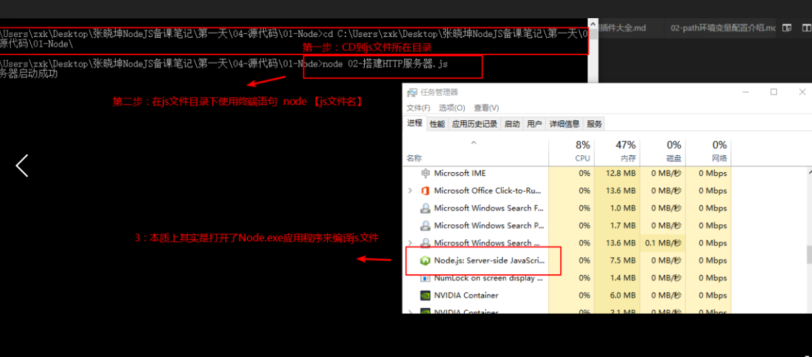
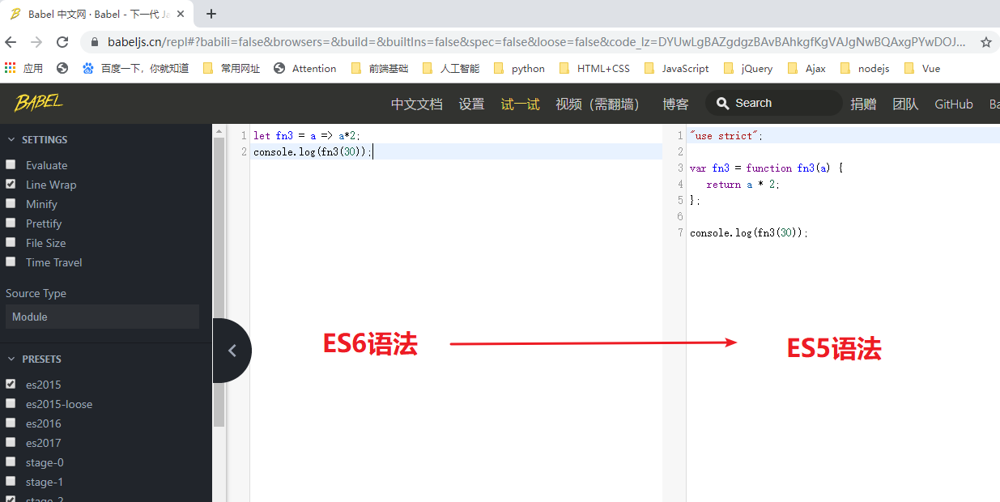

# 今日学习任务

[TOC]


# 01-nodejs入门

## 1.1-学习NodeJS的意义

* 1.`了解客户端浏览器与服务端后台的交互过程`，可以在以后的前端开发工作中与后台人员之间的沟通更加容易理解
  * 虽然以后工作中不一定用的上nodejs，但是通过对服务端开发的了解，能够让你在日常工作中与公司后台人员之间的沟通变得更加轻松
* 2.了解服务端开发的一些特性，可以在以后的工作中，当我们前端与后台交互出现bug问题时，能够更快速的定位bug是出现在自己的客户端还是别人的服务端。
  * 作为一名前端人员，如果对后台不了解，那么以后在与后台交互的开发中有可能明明是后台的问题，但是由于自身对后台的不了解再加上前期的经验不足，导致解决问题的时间增加（加班）。

* 3.了解服务端开发的过程，可以为以后的职业发展打下一定的基础（全栈工程师）


## 1.2-什么是nodejs


* 1.Node.js官网地址：<https://nodejs.org/en/>
* 中文:<http://nodejs.cn/api/>
* 1.Node 是一个构建于 Chrome V8引擎之上的一个Javascript 运行环境
  * Node`是`一个`运行环境`，作用是让js拥有开发服务端的功能
* 2.Node使用事件驱动、非阻塞IO模型（异步读写）使得它非常的轻量级和高效
  * Node中绝大多数API都是异步（类似于ajax），目的是提高性能
* 3.Node中的`NPM`是世界上最大的开源库生态系统（类似于github）
  * NMP官网:<https://www.npmjs.com>


## 1.3-Node.js环境安装

### 1.3.1-如何确认当前电脑是否已经安装了Node环境


* 打开终端，输入 `node -v`,如果能看到版本号则说明当前电脑已经安装Node环境，如果提示`Node不是内部或外部命令`，则表示未安装
  * ***一旦安装了node，则会自动一并安装`npm`***


### 1.3.2-npm介绍与cnpm安装


* 1.npm
  * 全称node package manager
  * 官方推出的包管理工具
  * 不需要额外安装，安装node之后自带
  * 因为服务器不在国内，所以有时候安装特别慢，甚至无法成功
* 2.cnpm
  * 全称china node package manager
  * 非官方推出的包管理工具
  * 需要额外安装：`npm install -g cnpm --registry=https://registry.npm.taobao.org`
  * 国内安装特别快，不需要翻墙（如果特殊情况无法安装，也可使用npm）
  * 安装成功之后，通过`cnpm -v`查看

## ==1.3-如何运行Node.js程序==

* 1.REPL：交互解释器

  * Node运行环境的另一种叫法，作用是解析执行js代码
  * 用法
    * 第一种方式：直接双击打开 node.exe,然后写js代码
    * 第二种方式：
      * 先在终端先执行node，进入node环境
      * 然后写js代码

* 2.使用终端命令`node [js文件路径]`开始运行js文件

  * （1）其实当我们在终端执行Node命令时，并不是我们终端去编译解释js代码，而是电脑会自动打开Node安装包中Node.exe应用程序来打开js文件
    * Node.exe是一个类似于终端的应用程序，没有界面(CLI程序：command-line interface，命令行界面)
    * Node.exe工作环境称之为REPL环境，也就是交互式解释器
  * （2）REPL才是真正解释执行我们js代码的解释器

  

  3.nodemon

  * node开发之友，当你的js文件发生变化的时候，nodemon会自动帮你启动node程序
* 安装: `npm install -g nodemon`
  
  * 使用：`nodemon [js文件名]`


## 1.4-服务端js与客户端js区别


* 1.客户端JS由三部分组成
  * ECMAScript：确定js的语法规范
  * DOM：js操作网页内容
  * BOM：js操作浏览器窗口
* 2.服务端JS只有ECMAScript
  * 因为服务端是没有界面的
    * ==**在nodejs中使用dom与bom的api程序会报错**==


# ==02-ES6语法新特性介绍==

  ## 1.1-变量声明let与const

  ```javascript
/* 
    1.学习目标 ： 掌握ES6新增两个关键字 let 与 const
      * let 与 const的作用是声明变量，类似于ES5的var关键字
    2.学习路线（对比法学习）
      (1) 复习ES5的var关键字两个特点
      (2) 介绍ES6的let与const关键字的两个特点
      (3) 介绍let与const的区别 与 注意点
*/

/* 1.ES5语法变量特点 */

// 1.1 变量会提升
console.log(num);//undefined
var num = 10;

// 1.2 没有块级作用域
for (var i = 1; i < 5; i++) {
  console.log('循环内' + i);
};

console.log('循环外' + i);//5

/* 2.ES6新增两种变量声明方式（let与const），类似于var
     (1).不会提升
     (2).有块级作用域
*/

// （1）如果打印undefined，说明提升了  （2）如果报错，说明没有提升
// console.log(a);//报错
// let a = 10;

// (2)如果打印5，说明没有块级作用域  （2）如果报错，说明有块级作用域
  
for(let j = 1;j<5;j++){
  console.log(j);
};

// console.log(j);

/* 3.let与const区别
  * 注意点：ES6中变量不能重复声明，否则会报错
*/

//let声明：变量，允许修改
let a = 10;
a = 20;
// let a = 30;//程序报错，不允许重复声明
console.log(a);

//const声明:常量，只可以声明的时候赋值一次，之后无法修改
const b = 100;
// b = 200;//程序报错
console.log(b);

  ```

  

## 1.2-解构赋值语法

* ==解构赋值语法 ： 其实就是变量赋值语法的简写形式==

### 1.2.1-对象的解构赋值

```javascript
/* 
    1.学习目标：掌握对象的解构赋值语法
        * 解构赋值本质 就是 变量赋值语法的简写形式
    2.学习路径 ： 对比法学习（ES5与ES6对比）
        （1）取出 对象的属性值 赋值给 变量
        （2）取出 变量的值 赋值给 对象的属性
        （3）设置 解构赋值语法 的默认值

*/

//解构赋值语法 ： 其实就是变量赋值语法的简写形式

//1：取出 对象的属性 赋值 给变量

let obj = {
    name:'张三',
    age:18,
    sex:'男'
};

/* ES5 */
// let name = obj.name;
// let age = obj.age;
// let sex = obj.sex;
// console.log(name,age,sex);

/* ES6 */

/* a.这行代码本质:声明三个变量 name，age，sex。取出右边obj对象对应的属性名赋值给左边的变量*/
// let {name,age,sex} = obj;
// console.log(name,age,sex);

/* b.由于obj对象没有score属性，所以变量score的值为undefined。 */
// let {name,score} = obj;
// console.log(name,score);

/* c. sex:gender 的含义 ： let gender = obj.sex */
// let {name,sex:gender} = obj;
// console.log(name,gender);

//2：取出变量的值 赋值给对象的属性

// let name = '李四';
// let age = 20;
// let sex = '男';
// let sayHi = function(){
//     console.log('你好');  
// };

/* ES5  */
// let person = { 
//     name : name,
//     age : age,
//     gender : sex,
//     sayHi :sayHi
// };
// console.log(person);

/* ES6 */
// let person = { 
//     name,//等价于 name:name
//     age,
//     gender:sex,//如果属性名和变量名不一致，还是按照以前ES5的写法来赋值
//     sayHi,
//     play(){//等价于：play:function(){}
//         console.log('学习使我快乐');
//     }
// };

// console.log(person);

//3. 设置 解构赋值语法 的默认值

let student = {
    name:'班长',
    age:38,
    sex:'女'
};
/* 
（1）  name = '坤哥'   
    a. 声明变量name : let name;
    b. 取出student对象的name属性值赋值给name : student.name
    c. 如果student对象没有name属性则赋值坤哥 :   if(student.name){ name = student.name }else{ name = '坤哥' }
    
 (2) sex:gender = '男'
    a. 声明变量gender : let gender;
    b. 取出student对象的sex属性值赋值给gender : student.sex
    c. 如果student对象没有sex属性则赋值男 :   if(student.sex){ gender = student.sex }else{ gender = '男' }
*/
let {name = '坤哥',score = 88,sex:gender = '男'} = student;
console.log(name,score,gender);//班长 88 女


```

### 1.2.2-数组解构赋值


```javascript
//数组解构赋值

let arr = [10,20,30];

/* ES5 */
// let n1 = arr[0];
// let n2 = arr[1];
// let n3 = arr[2];

// console.log(n1,n2,n3);

/* ES6 */
let [n1,n2,n3 = 50,n4 = 100] = arr;
console.log(n1,n2,n3,n4);// 10 20 30 100

```

### 1.2.3-函数参数解构赋值


```javascript
/* 
    1.学习目标 ： 掌握函数参数的解构赋值
    2.学习路线
        （1）复习 函数 传参的本质是 实参给形参赋值的过程
        （2）使用解构赋值语法 给函数传参
        （3）使用解构赋值语法 设置 函数的默认参数
*/

/* (1) ES5 :函数传参  */

/**
* @description:
* @param {Object}  obj:对象类型  {name:名字 age:年龄 sex:性别}
* @return: 
*/
// function fn(obj){
//     console.log(obj);
//     //声明三个变量接收对象的参数值
//     let name = obj.name;
//     let age = obj.age;
//     let sex = obj.sex;
//     console.log(name,age,sex);
// };

// fn({
//     name:'黑马李宗盛',
//     age:32,
//     sex:'男'
// });


/* (2) ES6 :函数传参  */

// function fn1({name,age,sex}){
//     //声明三个变量接收对象的参数值
//     console.log(name,age,sex);
// };

// fn1({
//     name:'黑马李宗盛',
//     age:32,
//     sex:'男'
// });

//添加解构语法默认值
// function fn2({name = '班长',age = 38,sex:gender='女'}){
//     //声明三个变量接收对象的参数值
//     console.log(name,age,gender);
// };

// fn2({
//     name:'黑马李宗盛',
// });

/* (3)函数默认参数 */

/* ES5:使用逻辑或短路运算实现 */
// function fn(n1,n2,n3){
//     n1 = n1 || 10;
//     n2 = n2 || 20;
//     n3 = n3 || 30;
//     console.log(n1,n2,n3);
// };

// fn(5,8);
// fn();

/* ES6:使用解构赋值语法默认值实现 */
function fn(n1 = 10,n2 = 20,n3 = 30){
    console.log(n1,n2,n3);
};

fn(5,8);
fn();
```


## 1.3-箭头函数

```javascript
/* 
    1.学习目标：学会使用ES6的箭头函数
        * 箭头函数 => 其实是 function 关键字的简写形式
        * 写法： 将function关键字使用 => 符号代替
    2.学习路线
        (1)介绍箭头函数的常见用法 ： 重点
        (2)介绍箭头函数的其他用法 ： 了解
*/

//1.箭头函数常见用法

//1.1 无参无返回函数

/* ES5 */

let fn = function(){
    console.log('111');
};
fn();

/* ES6
箭头函数规则： （1）function变成 箭头符号 =>   (2)形参小括号写到箭头 => 左边
*/

let fn1 = ()=>{
    console.log('222'); 
};
fn1();

//1.2 有参有返回函数

/* ES5 */
let add =  function(a,b){
    return a+b;
};

console.log(add(10,20));

/* ES6 */
let add1 = (a,b)=>{
    return a+b;
};

console.log(add1(100,200));

//2.箭头函数其他用法

//2.1 如果函数只有一个形参，则可以省略形参小括号
let fn2 = a=>{ 
    return a*2;
};

console.log(fn2(20));//40

//2.2 如果函数体只有一行代码，则可以省略函数体大括号
//注意点： 如果省略函数体大括号，则返回值也要省略return
//下面代码等价于：  let fn3 = function(a){ return a*2 }
let fn3 = a => a*2;

console.log(fn3(30));//60


```

## 1.4-模板字符串

```javascript
/* 
    1.ES5中的字符串 ： 一切以 引号'' 或 双引号"" 引起来的内容
        a. 不能在字符串中对变量取值，必须要使用连接符 +
        b. 无法识别字符串原有格式（缩进和换行），需要使用转义符 :  例如换行符 \n

    2.ES6中的模板字符串： 以 反引号`` 引起来的内容
        a. 可以在字符串中对象变量取值 ：  ${变量名}
        b. 可以识别字符串中原有格式
*/


let obj = {
    name:'张三',
    age:20,
    sex:'男'
};

var num = 100;

/* ES5 */

let str1 = '大家好' + 
'我的名字叫' + obj.name +
'我的年龄是' + obj.age +
'我的性别是' + obj.sex +

'我的分数是' + num;

console.log(str1);

/* ES6 */
let str2 = `大家好
我的名字叫${obj.name}
我的年龄是${obj.age}
我的性别是${obj.sex}

我的分数是${num}`;

console.log(str2);

```


## 1.5-拓展运算符


```javascript
/* 学习目标
1.拓展运算符：   ...
2.作用：类似于  对象遍历的一种简写形式
3.应用场景介绍
*/


//1.基本使用
let person = {
    name: '班长',
    age: 38,
    sex: '男'
};


let student = {
    score: 99,
    girlFriend: '代码'
};

let banzhang = {
    ...person,//相当于遍历person的属性名和属性值  赋值给班长对象
    ...student,
    hobby: '学习'
};

console.log(banzhang);//{ name: '班长',age: 38,sex: '男',score: 99,girlFriend: '代码',hobby: '学习' }


//2.应用场景

//2.1 连接两个数组
let arr1 = [10, 20, 30];
let arr2 = [40, 50, 60];

/* ES5写法 */
//concat:连接数组
// let arr3 = arr1.concat(arr2);
//连接之后 想要继续添加元素 需要继续调用push
// arr3.push(70);
// console.log(arr3);

/* ES6写法 */
let arr3 = [...arr1, ...arr2,70];
console.log(arr3);

//2.2 求数组最大值和最小值

let arr = [88,25,60,90,100];

/*  ES5写法 */
//利用apply传参特点 : 自动遍历arr，逐个传参
// let max = Math.max.apply(Math,arr);
// console.log(max);

/* ES6写法 */
let max = Math.max(...arr);
console.log(max);

```

## 1.6-数据类型Set

```javascript
/* 
1. Set :集合。 ES6新增的数据类型，类似于ES5的数组
2. Set与Array最大的区别 ： Set不支持重复元素
3. Set经典应用场景 ： 数组去重
*/

//1.基本使用
let set1 = new Set([10,20,30,40,10,40]);
console.log(set1);//Set(4) {10, 20, 30, 40}

//2.经典场景：数组去重
// let arr = [...set1];
// console.log(arr);//[ 10, 20, 30, 40 ]

//经典面试题：请使用一行代码实现数组去重
let arr = [20,60,88,50,20,66,100];

let arr1 = [...new Set(arr)];
console.log(arr1);//[ 20, 60, 88, 50, 66, 100 ]
```


## 1.7-babel网站：ES6转ES5

* 1.babel官网地址：https://www.babeljs.cn/repl
  * `babel作用`:把ES6语法转成ES5语法
  * 由于ES6是js的最新语法，所以有的老版本浏览器不支持。这个网站可以查询ES6支持哪些浏览器：https://www.caniuse.com/#search=es6
* 2.如果你的项目需要兼容老版本不支持ES6的浏览器，可以使用babel将你的 ES6语法转成ES5语法



# ==03-nodejs核心模块==

## 1.1-fs文件模块(读写文件)

### 1.1.1-readFile读取文件

```javascript
//1.导入文件模块

const fs = require('fs');

//2.读取文件

/**
 * 第一个参数：文件路径
 * 第二个参数：编码格式 （可选参数，默认为buffer二进制）
 * 第三个参数：读取回调操作（异步操作）
    * err:如果读取成功，err为null,  否则读取失败（一般文件路径错误或者找不到文件）
    * data:读取到的数据
 */
fs.readFile('./data/aaa.txt','utf-8',(err,data)=>{
    
    if(err){
        console.log(err);
        //抛出异常，throw的作用就是让node程序终止运行，方便调试
        throw err;
    }else{
        console.log(data);
    };
});

console.log('11111');

//3.同步读取文件(了解即可，几乎不用,一般在异步的api后面加上Sync就是同步)

let data = fs.readFileSync('./data/aaa.txt','utf-8');
console.log(data);

console.log('2222');
```


### 1.1.2-writeFile写入文件


```javascript
//1.导入文件模块
const fs = require('fs');

//2.写文件

/**
 * 第一个参数：文件路径
 * 第二个参数：要写入的数据
 * 第三个参数：文件编码 默认utf-8
 * 第四个参数： 异步回调函数
    * err:  如果成功，err为null.否则读取失败
 */
fs.writeFile('./data/bbb.txt','黑马程序员','utf-8',(err)=>{
    if(err){
        throw err;
    }else{
        console.log('写入成功');
    };
});
```


## 1.2-同步与异步区别


* 1.同步会阻塞线程，异步不会

* 2.同步有序执行，异步无序执行

* 3.同步没有回调函数，异步有回调函数

  

```javascript
//1.导入模块
const fs = require('fs');

/*js从上往下解析代码流程
    1.判断是同步还是异步
    2.如果是同步，则立即执行
    3.如果是异步，则不执行，而是放入事件循环中(Event Loop)
    4.所有代码解析完毕之后，开始执行事件循环中的异步代码

*/

/*异步操作
1.不会阻塞线程（性能高）
2.无序执行
3.有回调函数 
 */

//异步操作
// console.log('55555555');
// fs.readFile('./data/aaa.txt','utf8',(err,data)=>{
//     console.log('1111111');
    
//     if(err){
//         throw err;
//     }else{
//         // console.log(data); 
//     };
// });


// console.log('666666');
// fs.readFile('./data/aaa.txt','utf8',(err,data)=>{
//     console.log('222222');
    
//     if(err){
//         throw err;
//     }else{
//         // console.log(data); 
//     };
// });

// console.log('777777');
// fs.readFile('./data/aaa.txt','utf8',(err,data)=>{
//     console.log('333333');
    
//     if(err){
//         throw err;
//     }else{
//         // console.log(data); 
//     };
// });

// console.log('8888888');
// fs.readFile('./data/aaa.txt','utf8',(err,data)=>{
//     console.log('4444444');
    
//     if(err){
//         throw err;
//     }else{
//         // console.log(data); 
//     };
// });


//同步操作
/* 1.会阻塞线程（性能低）
    2.有序执行
    3.没有回调函数

 */
let data1 = fs.readFileSync('./data/aaa.txt','utf8');
console.log(data1);
console.log('11111');

let data2 = fs.readFileSync('./data/aaa.txt','utf8');
console.log('22222');
console.log(data2);

let data3 = fs.readFileSync('./data/aaa.txt','utf8');
console.log('33333');
console.log(data3);


let data4 = fs.readFileSync('./data/aaa.txt','utf8');
console.log('44444');
console.log(data4);

```


经典面试题


# ==04-Nodejs使用第三方模块流程(以爬虫模块Crawler为例)==

## 1.1-npm与cnpm介绍

* 1.npm
  * 全称node package manager
  * 官方推出的包管理工具
  * 不需要额外安装，安装node之后自带
  * 因为服务器不在国内，所以有时候安装特别慢，甚至无法成功
* 2.cnpm
  * 全称china node package manager
  * 非官方推出的包管理工具
  * 需要额外安装：`npm install -g cnpm --registry=https://registry.npm.taobao.org`
  * 国内安装特别快，不需要翻墙（如果特殊情况无法安装，也可使用npm）
  * 安装成功之后，通过`cnpm -v`查看


## 1.2-npm使用流程

* 1.初始化：在当前nodejs项目中执行终端命名: `npm init -y`
  * 作用：生成一个`pachage.json`文件，帮你记录当前项目安装了哪些第三方模块及对应的版本号
* 2.安装：在当前nodejs项目中执行终端命名: `npm install 模块名`
  * 安装之后，你的项目目录会新增两个文件`node_modules`与`package-lock.json`
    * `node_modules`:npm会自动将所有的第三方模块放入这个文件夹中。类似于前端的`lib文件夹`
    * `package-lock.json`：npm会自动记录第三方模块的下载地址，下一次安装或更新的时候直接从这个地址下载，速度更快(只是影响以后更新速度，不影响开发)
    * `pachage.json`:帮你记录当前项目安装了哪些第三方模块及对应的版本号
* 3.注意点：
  * (1)使用npm`文件夹路径`不能有中文
  * (2)使用cnpm安装第三方模块得时候需要添加 `--save`命令。  
    * 示例
      * npm安装crawler : `npm install crawler`
        * npm会自动执行`--save`，将下载路径保存到`package-lock.json`文件中
      * cnpm安装crawler : `cnpm install crawler --save`
  * (3)优先建议使用npm命令来安装。 如果网速很慢导致无法安装第三方模块，建议使用以下两种方式
    * a.优先建议 ： 更改npm镜像源为淘宝服务器
      * `npm config set registry https://registry.npm.taobao.org/`
      * 查看当前npm得镜像源：`npm config list  `
    * b.使用cnpm命令来安装第三方模块


## 1.3-第三方模块使用流程（适合所有第三方模块）

* 1.进npm官网搜索模块:https://www.npmjs.com/
* 2.按照官方文档要求安装模块`npm install 模块名`
* 3.复制粘贴官网代码(别人作者提前写好的)


### 爬虫实战

* crawler爬取网页

```javascript
//1.导入模块
var Crawler = require("crawler");

//2.创建爬虫对象
var c = new Crawler({
    maxConnections : 10,
    // This will be called for each crawled page
    callback : function (error, res, done) {
        //爬好之后会执行这个回调函数
        if(error){
            console.log(error);
        }else{
            //将爬好的数据赋值给juqery对象
            var $ = res.$;
            // $ is Cheerio by default
            //a lean implementation of core jQuery designed specifically for the server
            console.log($("html").html());
            //使用jquery的语法来解析页面
            console.log($('#lg>img').attr('src'));  
        }
        done();
    }
});
 
// Queue just one URL, with default callback
//3.开始爬虫
c.queue('http://www.baidu.com');
```


* crawler爬取文件


```javascript
var Crawler = require("crawler");
var fs = require('fs');
 
var c = new Crawler({
    encoding:null,
    jQuery:false,// set false to suppress warning message.
    callback:function(err, res, done){
        if(err){
            console.error(err.stack);
        }else{
            //将爬取好的文件通过fs模块写入文件
            fs.createWriteStream(res.options.filename).write(res.body);
        }
        
        done();
    }
});
 
//绝大多数网站，都有反爬机制。只有小众网站没有
//浏览器可以下载，但是服务端爬虫无效。反爬：检测你这个请求是通过浏览器发出来，还是服务端（解决方案：让服务端伪装成浏览器来发这个请求）
c.queue({
    url:"http://upos-hz-mirrorks3u.acgvideo.com/upgcxcode/75/11/112251175/112251175-1-6.mp4?e=ig8euxZM2rNcNbdlhoNvNC8BqJIzNbfq99M=&uipk=5&nbs=1&deadline=1571396695&gen=playurl&os=ks3u&oi=2005998532&trid=a4c624adafe64ababb2a851334eaf87eh&platform=html5&upsig=2a29cd105837278e3b4c92181fe3eb59&uparams=e,uipk,nbs,deadline,gen,os,oi,trid,platform&mid=0",
    filename:"./video/11111.mp4",//写入文件名 默认在根目录
    headers:{'User-Agent': 'requests'}//让服务端伪装成客户端
});
```


