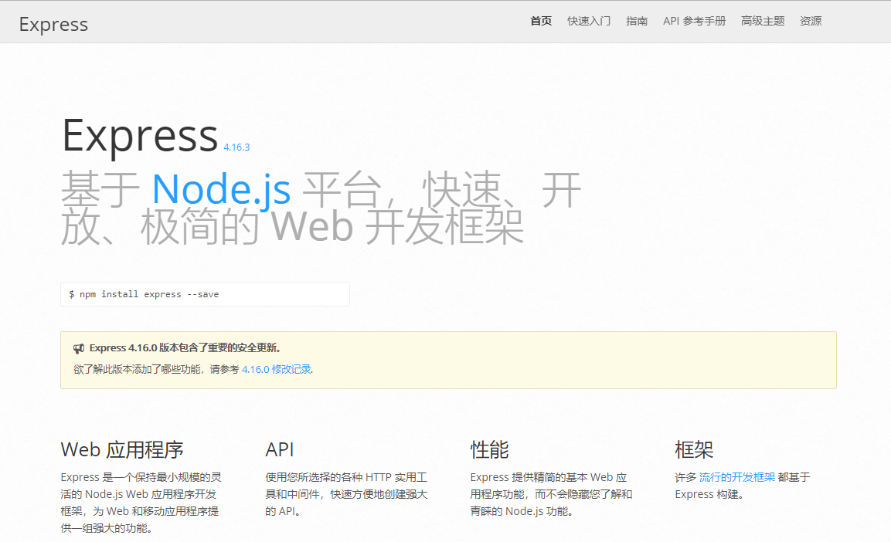
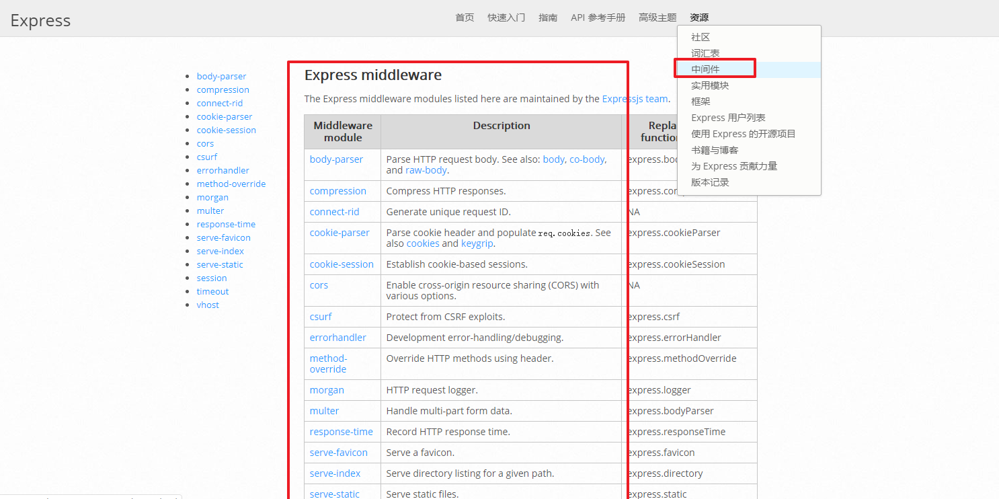
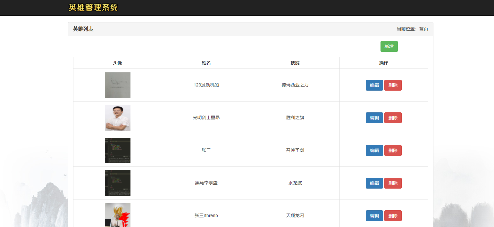
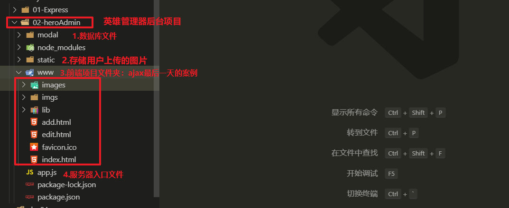
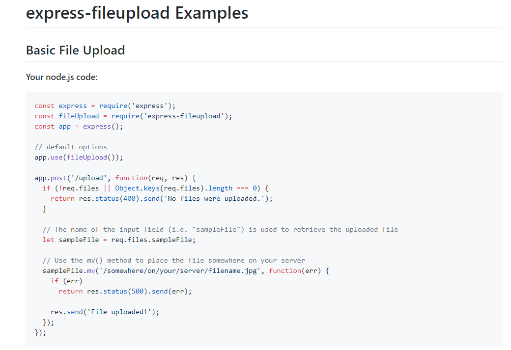

# ==01-Express框架学习==


## 1.1-Express框架介绍

* 1.Express是NodeJS开发中一个非常重量级的第三方框架，它对于NodeJS服务端就相当于Jquery对于HTML客户端。
  * **如果连Express都不会用，基本上都不好意思跟别人说你会NodeJS**
* 2.Express官网：
  * http://www.expressjs.com.cn/
  * http://expressjs.com/
    * 一般我们学习一个新的技术，都是去官网文档查看它的API，然后多多尝试，熟能生巧
* 3.Express的github地址:<https://github.com/expressjs/express>
  * Express的原作者TJ在node社区非常的有名，他写过200多个框架，目前他已经将Express交给了朋友维护，宣布不再维护NodeJS框架，转向Go语言<https://github.com/tj>
* 4.Express官网是这样介绍自己的:基于 Node.js 平台，快速、开放、极简的 web 开发框架。
  * *Express一个非常重要的亮点就是它没有改变nodejs已有的特性，而是在它的基础上进行了拓展*
    * **也就是说，使用Express你既可以使用nodejs原生的任何API，也能使用Express的API**
* `5.Express三大核心功能`
  * 1.托管静态资源
    * 第二天讲的nodejs实现静态服务器功能在express中只需要一行代码
  * 2.路由
    * express自带路由功能,让Node服务端开发变得极其简单
    * express支持链式语法，可以让代码看起来更加简洁
  * ==3.中间件==
    * Express最为核心的技术和思想，万物皆中间件
      * 中间件虽然理解起来有点困难，但是使用起来非常方便，类似于`jquery的插件`一样，由于jquery库自身的功能无法满足开发需求，所以通过插件来拓展功能




## 1.2-Express基本使用


```javascript
//1.导入模块
const express = require('express');

//2.创建服务器
/* express() 相当于http模块的http.createServer() */
let app = express();


//3.接收客户端请求
/*（1）express最大的特点就是自带路由功能，我们无需在一个方法中处理所有请求
		* 路由：一个请求路径对应一个方法(函数)
   (2)在express中，每一个请求都是一个单独的方法
 */

app.get('/',(req,res)=>{
    //响应客户端数据

    //express响应数据 send方法:自动帮我们设置好了响应头,无需担心中文乱码问题
    res.send('欢迎来到黑马程序员');

    // //以前的做法；如果是中文，需要设置响应头解决乱码问题
    // res.writeHead(200,{
    //     'Content-Type':'text/plain;charset=utf8'
    // });
    // res.end('欢迎来到黑马程序员');
});

app.get('/heroInfo',(req,res)=>{
    //express自动帮我们解析了get请求参数，我们直接通过req.query获取即可
    console.log(req.query);
});

//4.开启服务器
app.listen(3000,()=>{
    console.log('服务器启动成功');
});
```


## 1.3-Express响应客户端数据

```javascript
//1.导入模块
const express = require('express');

//2.创建服务器
/* express() 相当于http模块的http.createServer() */
let app = express();


//3.接收客户端请求

//文本类型数据
app.get('/',(req,res)=>{
    //响应客户端数据
    res.send('欢迎来到黑马程序员');
});

//json格式数据
app.get('/info',(req,res)=>{
    //响应json : express自动帮我们转换
    res.send({name:'张三'});

    /* 以前的做法
    使用JSON.stringify() : 将js对象转成json字符串
    */
   //res.end(JSON.stringify({name:'张三'}));
});

//文件类型数据
app.get('/login',(req,res)=>{
    //express自动帮我们解析了get请求参数，我们直接通过req.query获取即可
    console.log(req.query);
    res.sendFile(__dirname + '/login.html');
});

//4.开启服务器
app.listen(3000,()=>{
    console.log('服务器启动成功');
});
```


## 1.4-Express托管静态资源

* ***将第二天的nodejs实现静态服务器功能用Express实现***

  

```javascript
//1.导入模块
const express = require('express');

//2.创建服务器
let app = express();

//托管静态资源（相当于我们之前写的一大坨模拟apache服务器功能代码）
/* 
1.当请求路径为/时，express会自动读取www文件夹中的index.html文件响应返回
2.当路径请求为www文件夹中的静态资源，express会自动拼接文件路径并响应返回
*/
app.use(express.static('www'));

//4.开启服务器
app.listen(3000,()=>{
    console.log('success');  
});
```

## ==1.5-第三方中间件使用==


* 1.在Express官网，有非常多得第三方中间件，它们可以让我们的Nodejs开发变得极其简单
  * `中间件类似于jquery的插件，使用后就会给express中的req或者res添加成员`
  * jqeury插件的原理：给jquery的原型添加成员
* 2.所有的第三方框架学习套路都是一样的
  * 1.进官网，查文档
  * 2.CTRL+C 与 CTRL+V
* 3.第三方中间件使用步骤一般都是固定两步
  * 一： 安装 `npm i xxxx`（官网复制粘贴）
    * **第三方中间件都需要使用npm安装，可以理解为是一种特殊的第三方模块**
  * 二:   使用 `app.use(xxx)`（官网复制粘贴）




* body-parse第三方中间件：解析post请求参数
  * 安装body-parser : `npm install body-parser`


```javascript
//导入模块
const express = require('express');
//创建服务器
let app = express();

//使用第三方中间件
/*所有的第三方模块思路都是一样 
    1.进官网，查文档
    2.找examples（使用示例），复制粘贴
        a.安装第三方模块：`npm i body-parser`
        b.使用中间件: arr.use(具体用法请复制粘贴) 
使用body-parser中间件之后，你的req会增加一个body属性，就是你的post请求参数
*/
//（1）导入模块
var bodyParser = require('body-parser');//导入模块
// parse application/x-www-form-urlencoded 
//（2）使用中间件
app.use(bodyParser.urlencoded({ extended: false }))


app.post('/abc',(req,res,next)=>{
    console.log(req.body);
    //告诉客户端我收到的参数
    res.send(req.body);
});

app.post('/efg',(req,res,next)=>{
    console.log(req.body);
    //告诉客户端我收到的参数
    res.send(req.body);
});

//开启服务器
app.listen(3000, () => {
    console.log('success');
});
```


# 02-Express项目实战-heroAdmin后台管理系统

## 1.1-项目介绍

* 1.了解Express搭建服务端项目的流程
  * a.导入express
  * b.创建服务器
  * c.配置中间件
  * d.路由
  * e.开启服务器
* 2.了解服务端路由处理流程（路由：其实就是前端的接口文档）
  * 请求 ： 获取客户端发送过来的参数
  * 处理： 增删改查数据库
  * 响应 ：将数据库的操作结果返回给客户端
* 3.了解服务端接收文件的流程
  * 中间件 `express-fileupload`的使用


* 在ajax最后一天，我们通过综合案例hero_admin了解了前端ajax增删改查的业务逻辑
  * `在nodejs阶段，我们通过实现hero_admin案例的后台，了解服务端增删改查的业务逻辑`
    * PS：相当于使用nodejs实现ajax阶段课堂案例的后台




## 1.2-项目准备工作

* 1.将ajax最后一天案例hero_admin,写好的前端代码复制粘贴到`www`文件夹中
  * 作用：托管静态资源
* 2.将今天课程资料中的 `model`文件夹 与 `static`文件夹复制粘贴到项目中
  * model :数据库文件（本阶段先了解后台的工作流程，数据库使用提前写好的）
  * static : 用于存储用户上传的图片
* 3.安装本项目需要使用的第三方模块
  * a. 初始化npm : `npm init -y`
  * b.安装express与body-parser : `npm i express body-parser`
    * i : install简写
    * express body-parser：npm支持一次性安装多个模块，模块之间使用空格隔开即可




| 服务器说明            | 作用描述        |
| --------------------- | --------------- |
| http://127.0.0.1:4399 | 服务器基地址    |
| 200                   | 请求成功 状态码 |
| 201                   | 新增成功        |
| 202                   | 编辑成功        |
| 204                   | 删除成功        |
| 500                   | 服务器内部错误  |

| 接口名称     | URL          | 请求方式 | 请求参数                | 返回值            |
| ------------ | ------------ | -------- | ----------------------- | ----------------- |
| 查询英雄列表 | /hero/all    | get      | 无                      | [data:{英雄列表}] |
| 删除英雄     | /hero/delete | get      | id                      | {code:204}        |
| 新增英雄     | /hero/add    | post     | name , skill , icon     | {code:201}        |
| 查询英雄     | /hero/id     | get      | id                      | {data:{英雄详情}} |
| 编辑英雄     | /hero/update | post     | name , skill , icon，id | {code:202}        |

## 流程


```javascript
//1.导入模块
const express = require('express');
//2.创建服务器
let app = express();
//3.配置中间件
//3.1 托管静态资源
app.use(express.static('www'));
app.use(express.static('static'));
//3.2 body-parser:解析post请求参数
//导入模块
const bodyParser = require('body-parser');
//使用中间件
app.use(bodyParser.urlencoded({ extended: false }));
//3.3 数据库 ： 增删改查数据
const heroModel = require('./modal/heroModel.js');

//4.路由（前端人员的接口文档）

//4.1 查询所有英雄：  /hero/all
app.get('/hero/all', (req, res) => {
});

//4.2 删除英雄 ： /hero/delete
app.get('/hero/delete', (req, res) => {
});

//4.3 新增英雄  /hero/add
app.post('/hero/add', (req, res) => {
});

//4.4 查询英雄   /hero/id
app.get('/hero/id', (req, res) => {
});

//4.5 编辑英雄   /hero/update
app.post('/hero/update', (req, res) => {
});


//5.开启服务器
app.listen(4399, () => {
    console.log('success');
});
```


## 1.4-完成首页查询英雄列表

```javascript
//4.1 查询所有英雄：  /hero/all
app.get('/hero/all', (req, res) => {
    //处理：查询数据库所有数据返回
    let heros = heroModel.all();
    console.log(heros);
    //响应
    res.send({ data: heros });

});
```


## 1.5-完成首页删除英雄

```javascript
//4.2 删除英雄 ： /hero/delete
app.get('/hero/delete', (req, res) => {
    //请求 ： 获取参数id
    let id = req.query.id;
    console.log(req.query);
    //处理：删除数据库数据
    let success = heroModel.delete({ id });
    //响应：成功：204 失败：500
    if (success) {
        res.send({ code: 204, msg: '删除成功' });
    } else {
        res.send({ code: 500, msg: '删除失败' });
    };
});
```


## ==1.6-完成新增英雄 (难点：nodejs如何接收客户端formdata上传的文件)==

* 1.formdata上传的文件，在nodejs中无法直接接收，需要接触第三方模块（第三方库）来处理
* 2.express处理前端文件上传的中间件 ： `express-fileupload`
  * express-fileupload官网地址:https://github.com/richardgirges/express-fileupload
* 3.express-fileupload中间件使用流程
  * (1)装包 ： `npm i xpress-fileupload`
  * (2)配置中间件：查阅官方文档 example
    * 导包:`const* fileUpload = require('express-fileupload');`
    * 使用中间件:`app.use(fileUpload());`
  * (3)接收用户上传的文件



```javascript

//3.配置中间件
//3.1 托管静态资源
app.use(express.static('www'));
app.use(express.static('static'));
//3.2 body-parser
//导入模块
const bodyParser = require('body-parser');
//使用中间件
app.use(bodyParser.urlencoded({ extended: false }));
//3.3 数据库
const heroModel = require('./modal/heroModel.js');
//3.4 文件上传
//使用该中间件之后，express中的req对象会添加一个files属性 用于接收客户端上传的文件
const fileUpload = require('express-fileupload');
app.use(fileUpload());

```

```javascript
//4.3 新增英雄  /hero/add
app.post('/hero/add', (req, res) => {
    //请求 ： 获取参数 文件 + 文本
    console.log(req.files);
    console.log(req.body);
    let icon = req.files.icon;
    let { name, skill } = req.body;
    //处理 ：文件存入static 文本存入数据库
    icon.mv(__dirname + '/static/imgs/' + icon.name, function (err) {
        if (err)
            return res.status(500).send(err);
    });
    //数据库存储的是文件的url路径
    let success = heroModel.save({
        name,
        skill,
        icon: '/imgs/' + icon.name
    });
    //响应：成功：201 失败：500
    if (success) {
        res.send({ code: 201, msg: '新增成功' });
    } else {
        res.send({ code: 500, msg: '新增失败' });
    };

});
```

## 1.7-完成根据id查询英雄详情

```javascript
//4.4 查询英雄   /hero/id
app.get('/hero/id', (req, res) => {
    //请求 ： 获取参数id
    let id = req.query.id;
    //处理 ： 查询数据库
    let hero = heroModel.id({ id });
    //响应
    res.send({ data: hero });
});
```


## 1.8-完成编辑英雄

```javascript
//4.5 编辑英雄   /hero/update
app.post('/hero/update', (req, res) => {
    //请求 ： 获取参数 文件 + 文本
    console.log(req.files);
    console.log(req.body);
    let icon = req.files.icon;
    let { name, skill,id } = req.body;
    //处理 ：文件存入static 文本存入数据库
    icon.mv(__dirname + '/static/imgs/' + icon.name, function (err) {
        if (err)
            return res.status(500).send(err);
    });
    //数据库存储的是文件的url路径
    let success = heroModel.update({
        name,
        skill,
        id,
        icon: '/imgs/' + icon.name
    });
    //响应：成功：202 失败：500
    if (success) {
        res.send({ code: 202, msg: '编辑成功' });
    } else {
        res.send({ code: 500, msg: '编辑失败' });
    };
});
```

