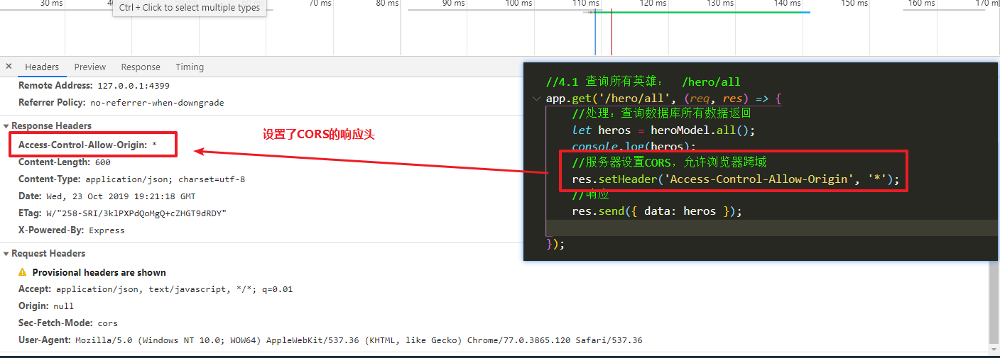
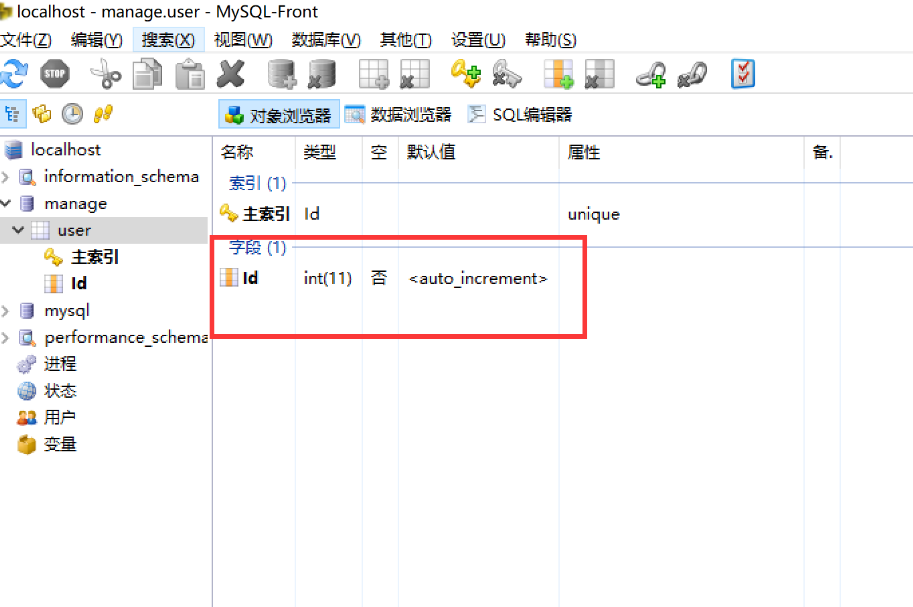
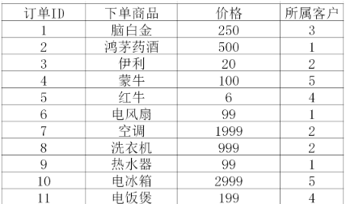

# ==01-跨域==

## 1.1-跨域介绍

* `1.跨域固定报错格式`
  * 只要是出现跨域问题，浏览器就会出现一个固定格式(没有之一)的报错信息
    * `Access to XMLHttpRequest at '服务器url地址' from origin 'null' has been blocked by CORS policy: No 'Access-Control-Allow-Origin' header is present on the requested resource.`


* `2.什么是跨域？`
  * **浏览器使用 `ajax`时**，如果请求了的**`接口地址`** 和  当前**`打开的页面`** 地址  **`不同源`** 称之为跨域
    * （1）ajax : 浏览器只有使用ajax发送请求才会出现跨域。  href属性与src属性不会出现跨域
    * （2） 接口地址 ： ajax请求的url
    * （3）打开的页面：当前页面的window.location.href
    * （4）不同源  ： 浏览器使用ajax,向不同源的接口发送请求，称之为 跨域访问 
* `3.什么是同源？`
  * MDN官方文档传送门：https://developer.mozilla.org/zh-CN/docs/Web/Security/Same-origin_policy
  * 同源定义 ： 两个url地址的 `协议` 与 `主机` 与 `端口` 均一致 (&&)
    * 协议：http , https , file
    * 主机 ： 域名或者ip地址 （127.0.0.1）
    * 端口 ：3000， 4399
  * 不同源定义： 两个url地址，`协议 主机 端口`任何一个不一致 （||）
    * `file:///C:/Users/%E5%BC%A0%E6%99%93%E5%9D%A4/Desktop/%E5%BC%A0%E6%99%93%E5%9D%A4%E5%89%8D%E7%AB%AF%E5%A4%87%E8%AF%BE%E8%B5%84%E6%96%99/%E5%85%A8%E5%A4%A9%E6%A8%A1%E5%BC%8F/07-Nodejs/2.0%E7%89%88%E6%9C%AC/%E8%AF%BE%E7%A8%8B%E8%B5%84%E6%96%99/%E5%A4%87%E8%AF%BE%E4%BB%A3%E7%A0%81/day03/02-heroAdmin/www/index.html](file:///C:/Users/张晓坤/Desktop/张晓坤前端备课资料/全天模式/07-Nodejs/2.0版本/课程资料/备课代码/day03/02-heroAdmin/www/index.html`
    * `http:127.0.0.1:3000/abc`
    * `http:127.0.0.1:3000/efg`
    * `https:127.0.0.1:3000/efg`
    * `http:127.0.0.1:3000/hero/add`
    * `http:127.0.0.1:4399/hero/add`
    * `http:127.0.0.1:4399/hero/all`


* `4.为什么要有同源与不同源？`
  * 出于安全考虑，浏览器不允许，页面向不同源的接口请求数据，因为如果 接口 和 网页不同源，浏览器认为是2个不同的 服务器，
  * 不同的服务器中内容是不可控的，不允许访问了
  * 总结说人话： `浏览器为了保护你的电脑安全`
    * 举个栗子： 你去肯德基店里点餐，店员只允许你点肯德基的产品（炸鸡，可乐，上校鸡块），如果此时你在肯德基店里面点麦当劳的产品，浏览器会认为你是坏人，就会让保安把你赶出去
* `5.跨域解决方案介绍`
  * 跨域是前端工作中不可避免的问题：我们经常会出现请求不同源接口的情况，为了能够获取数据，解决跨域的问题方案也有很多，但是常用的就两种
  * 第一种 ： `CORS`
    * 目前的主流方案，也是最简单的方案
  * 第二种：`JSONP`
    * 曾经的跨域杀手，专治各种跨域问题。现在慢慢的淡出历史舞台
    * PS：面试官特别喜欢问这个，因为这个有一定的技术难度，也能体现一个人的实际开发经验


```html
<!-- 

1.跨域固定报错格式
    * 只要是出现跨域问题，浏览器就会出现一个固定格式(没有之一)的报错信息
    * Access to XMLHttpRequest at '服务器url地址' from origin 'null' has been blocked by CORS policy: No 'Access-Control-Allow-Origin' header is present on the requested resource.

2.什么是跨域
    * 浏览器使用 ajax时，如果请求了的接口地址 和  当前打开的页面 地址  不同源 称之为跨域
        * ajax : 浏览器只有使用ajax发送请求才会出现跨域。href属性与src属性不会出现跨域
    * 接口地址 ： ajax请求的url
    * 打开的页面：当前页面的window.location.href
    * 不同源  ： 浏览器使用ajax,向不同源的接口发送请求，称之为 跨域访问 

3.什么是同源？
    * 同源定义 ： 两个url地址的 协议 与 主机 与 端口 均一致 (&&)
        * 协议：http , https , file
        * 主机 ： 域名或者ip地址 （127.0.0.1）
        * 端口 ：3000， 4399
    * 不同源定义： 两个url地址，协议 主机 端口任何一个不一致 （||）
        * 当前页面：http:127.0.0.1:3000/abc
        * 同源(协议 ip 端口一致)：http:127.0.0.1:3000/efg
        * 不同源(协议不一致): https:127.0.0.1:3000/efg
        * 不同源(ip不一致): http:192.0.0.1:3000/efg
        * 不同源(端口一致): http:127.0.0.1:4399/abc

4.为什么要有同源与不同源？
    * 浏览器为了用户安全 ： 不允许，页面向不同源的接口请求数据，
    因为如果 接口 和 网页不同源，浏览器认为是2个不同的 服务器，

5.跨域的几种解决方案
    * 常用： CORS
    * 面试官喜欢问：JSONP
    * 了解即可： 浏览器主动设置允许跨域（需要用户主动设置，只对当前设置浏览器生效）
 -->
```


## ==1.2-跨域解决方案一： CORS==

* **`注意：CORS技术在实际工作中由后端人员来实现，前端不需要做任何事情`**

### 1-CORS工作原理介绍


* CORS :全称`cross origin resource share` （资源共享）
* 工作原理： **服务器** 在返回响应报文的时候，在响应头中 设置一个允许的header 
  * `res.setHeader('Access-Control-Allow-Origin', '*');`
    * 这行代码的意思是：服务器对浏览器说：老铁我是个好人，不要拒绝我！





### 2-express使用中间件cors ： 给所有的res添加默认请求头Access-Control-Allow-Origin

* express有一个自带的中间件cors，它的作用是自动给每一个res设置默认请求头
  * 这样就不用我们自己每一个接口都要设置一次了


* 用法介绍


* cors中间件是最简单的中间，底层原理如下

```javascript
app.use((req, res, next) => {//任何请求都会进入这个use中间件
  res.setHeader('Access-Control-Allow-Origin', '*')//设置响应头
  next()//执行下一个中间件
})
```


## 1.3-跨域解决方案二：原生jsonp

* 1.JSONP的核心原理：如果script标签的src属性的请求，服务器返回的是一个函数调用。则浏览器会执行这个函数
  * 这是浏览器script标签的一个的漏洞（历史遗留问题）


* 2.实际开发中JSONP的工作流程
  * （1）设置script标签的src属性，向一个不同源的接口发送一个get请求
    * JSONP只支持get请求，不支持post
  * （2）src属性发送请求时，在参数中额外携带一个callback的参数，参数值是一个在页面中预先定于好的函数名
    * callback : 这是发明jsonp技术的人提出的一个`君子之约`，只要是jsonp前端程序员都统一将参数名定义为callback
      * PS：别的参数也行，只要和服务器协商好
    * callback属性值：预先定义的函数名，这个函数必须要在script标签之前定义
  * (3)服务器接收到请求之后，获取callback的参数值
  * (4)服务器将要响应的数据拼接成  `函数调用格式`，通过传参的方式将响应数据返回给浏览器


* 3.JSONP与CORS区别
  * CORS：
    * 服务器返回响应头，前端无需任何处理
    * 简单快捷，支持所有请求方式
  * JSONP
    * 浏览器：自定义响应回调函数，使用script标签的src请求
      * 利用浏览器的src属性没有跨域这一限制特点
    * 服务器：接收callback参数，返回函数调用
    * 处理复杂，并且只支持get请求
      * 原因：get请求参数直接在url后面拼接，而post请求参数是放在请求体中

## 1.4-跨域解决方案三： jQuery中的jsonp

* 只需要一行代码： `dataType:'jsonp'`即可
  * 底层原理与原生一致，设置dataType为jsonp，jq会自动动态帮我们创建一个script标签，将url放到src属性中
  * 细节注意点：jq使用jsonp不需要自己设置callback，jq会自动帮我们发送callback参数，参数值就是jq的success回调函数


## 1.5-跨域解决方案四：谷歌浏览器设置跨域（了解即可）

* 跨域是浏览器的一个安全限制

* 可以通过修改一些设置，让被设置的浏览器没有这个同源的限制

* 修改之后
  * 1.浏览器明确告诉你 不安全 （不安全，一般没人设置）
  * 2.只有设置的浏览器可以跨域（需要用户主动设置）
* 仅作课后了解即可：https://www.cnblogs.com/laden666666/p/5544572.html

# 02-MySQL数据库使用


## 1.1-mysql数据库介绍

* 1.什么是数据库？
  * 存储数据的仓库(文件夹)
* 2.如何学习数据库？
  * 增删改查
    * 衡量你会不会使用一个数据库，就看你能否实现数据的增删改查
* 3.安装mysql数据库软件
  * 安装phpstudy软件自带mysql数据库
* 4.数据库存储结构介绍
  * 数据库服务（安装软件）
    * 数据库database（一个数据库服务可以有很多个数据库）
      * 表table(一个数据库下可以有很多张表)
        * 列column:表中要存储哪些数据
        * 行row：具体的某一条数据


## 1.2-mysql图形化工具使用流程

### 1 打开界面

- 打开PHPStudy，然后点  `MySQL管理器`，在弹出的界面中选  `MySQL-Front`
- 如图：

 

- 弹出的界面点打开即可


 


### 2 新建数据库 

- 打开后，右键localhost，然后依次选新建、数据库。


- 输入数据库名字，再点确定就好。**注意：请使用英文名字。**

### 3 建表

- 为了更好的对数据进行分类，数据库提供了  `数据表`   。方便对这些数据归类。可以把  `数据表`  理解为一个  `表格`（如下图）。	


 


- 建表步骤
   


- 此处我们新建一个叫student的数据表，专门用来存每个用户的信息。


### 4-字段

- 建好表后，我们看到有一块区域叫  `字段`
- 字段可以理解为是表格中的列名



- 添加字段如图：


```
说明：
	1. 字段名可以理解为就是列名
	2. 类型根据实际情况选择对应类型，例如姓名一般是字符串，在数据库中选择VarChar（数据库中字符串类型）
	3. 长度就是说字符串最多允许多少位，长度越小，占用空间越小。（我们用默认长度即可）
```

- 然后我们再依次加  `name`和 ` age`两个字段。


### 5 插入一条数据

- 点中间的  `数据浏览器`


- 下图类似表格的界面就是新增数据的地方。


- 我们只在  `name`，`age`，字段下加数据(Id不加，自动生成)


- 插入新纪录：对着任意记录  `右键`，再点  `插入新纪录`  即可

```
结论：
	1. Id这个字段里是自动生成的依次递增的整数。
	2. Id字段的作用就是作为某条数据的身份证,用来区分不同的数据
```


### 6 建表练习

- 新建一个客户表，内容如下：
   
   
- 命名提示
  
   ​	客户表的名称叫：customer
   
   ​	字段客户ID叫：cId
   
   ​	字段客户名称叫：cName
   
   ​	字段年龄叫：cAge

* 前端其实将数据库中的数据做的页面酷炫一点


- 新建一个订单表，内容如下

 新建一个订单表，内容如下：




> 命名提示：
>
> 订单表的名称叫：horder
>
> 	字段订单ID叫：oId
> 	
> 	字段下单商品叫：goodsName
> 	
> 	字段价格叫：price
> 	
> 	所属客户叫：custormId


## 1.3-SQL语句学习(了解即可)

### 1 SQL语句介绍

> SQL语言，是一种专门对数据库进行操作的语言。
>
> 像我们刚刚通过右键就能插入一条数据，但其实它的本质就是执行一条SQL语句

* sql语句学习传送门：https://www.w3school.com.cn/sql/index.asp


### 2 增删查改语句

#### 2.1 增删查改的意思

- 增：新增记录	insert 


- 删：删除记录    delete


- 查：查询记录    select


- 改：修改记录    update

#### 2.2 insert语句

>  insert语句对应的是“增”，也即新增数据

- 基本用法：

```sql
insert into 表名(字段名) values(值);
```

- 例：

```mysql
insert into student(name,age) values('andy',20);
```

> 代表给student表新增一条数据，name的值为andy，age的值为20。


#### 2.3 delete语句

> delete语句对应的是“删”，也即删除数据

- 用法（慎用）：

```mysql
delete from 表名;
```

- 例：

```mysql
delete from student;
```

- 在执行这条语句前我们student表里有两条数据

 

- 执行完后，我们发现，数据全没了

 


>  结论：delete语句默认会删除表格中的所有数据，要 `慎用` 

- 按条件删除，用法：（常用）

```mysql
delete from 表名 where 字段 = 某个值;
```

- 例：

```mysql
delete from student where id = 2;
```

>  说明：这代表删除student表下，id为2的那条记录

- 也可以按范围删除，例：

```mysql
delete from student where id <= 3;
```

> 说明：这代表删除student表下，id小于或等于3的那些记录


#### 2.4 select语句

> select语句对应的是“查”，即查询记录

**指定查询某些字段**

- 用法：

```mysql
select 字段 from 表名;
```

- 例：

```sql
select name,age from student;
```

说明：这会查询出student表下所有数据，只会包含`name`和`age`字段。如果还有其他字段，结果中不会包含。


**查询所有字段**

- 用法：

```sql
select * from 表名;
```

- 例：

```sql
select * from student;
```

>  默认会查询出表中的所有数据，如果想指定条件查询，也可以在后面加  `where`

- 例：

```sql
select * from student where id < 10;
```

>  说明：只查询出id小于10的数据，不包括10


#### 2.5 update语句

> update语句对应的是“改”，也即修改某条数据

- 用法（慎用）：

```sql
update 表名 set 字段 = 新值;
```

- 例：

```sql
update student set name = '黑马一哥';
```

>  说明：把student表中所有数据的name值改为黑马一哥，注意，此操作是修改所有，所以要小心使用！


- 指定条件修改，例：

```sql
update student set name = '黑马一哥' where id = 3;
```

>  只修改id为3的这条数据，把name改成黑马一哥


### 3. 扩展知识

#### 3.1 通配符-->模糊查询

> `%`为通配符，一般搭配 `like` 关键字使用。

#### 3.2 以什么开头

- 查询所有  `字段`  以 `关键字`  开头的数据

```mysql
select * from 表名 where 字段 like '关键字%'; 
```

- 例：

```mysql
-- 查询user表中name以j开头的所有数据
select *from student where name like 'j%';
```

#### 3.3 以什么结尾

- 查询所有  `字段`  以 `关键字` 结尾的数据

```mysql
select * from 表名 where 字段 like '%关键字''; 
```

- 例：

```mysql
-- 查询student表中name以y结尾的所有数据
select *from student where name like '%y';
```

#### 3.4 包含什么内容

- 查询所有  `字段`  包含 `关键字` 的数据

```mysql
select * from 表名 where 字段 like '%关键字%'; 
```

- 例:

```mysql
-- 查询student表中name中包含o的所有数据
select *from student where name like '%o%';
```


####3.5 并且条件

- 使用and关键字，例：

```mysql
-- 查询student表中name为jack，并且age为20的数据
select *from student where name='jack' and age='20'
```


#### 3.6 或者条件

- 使用or关键字，例

```mysql
-- 找到student表中age小于10，或者age大于100的数据
select *from student where age < 10 or age > 100;
```


#### 3.7 连表查询

- 很多时候同一个页面的数据是从多张表取出
- 例如：如果想展示所有用户的信息以及它下的订单商品，就需要找到两张表的数据联合起来。
- 如图：


- 语法：

```mysql
select 字段 from 表1 inner join 表2 on 对应关系
```

- 例:

```mysql
-- 找到customer和horder双表结合的结果，只把customer中的cId字段和horder表中custormId字段相等的记录组合在一起
select *from customer inner join horder on customer.cId =  horder.custormId
```

- 如果觉得表名太长，可以给表名起别名，例：

```mysql
select *from customer c inner join horder h on c.cId =  h.custormId
```


#### ==3.8 分页查询==

- 有时候某张表里有大量数据，而我们只需要查中间的某几条，因此可以用下面的分页查询语句

```mysql
select * from 表名 limit 第几条开始,查几条;
```

- 例：

```mysql
-- 查询student表里第10条到第20条数据（一共查出来10条）
select * from student limit 10,10;
```


## 1.4-nodejs实现mqsql数据增删改查

* 数据库模块mysql介绍
* <https://www.npmjs.com/package/mysql>
* npm安装：`npm install mysql`
* 使用流程: 
  * 导入模块
  * 连接数据库
  * 执行sql语句
  * 关闭数据库

```javascript
//1.导入模块
var mysql = require('mysql');
//2.连接数据库
var connection = mysql.createConnection({
    host: 'localhost',//数据库地址
    port:'3306',
    user: 'root',//用户名，没有可不填
    password: 'root',//密码，没有可不填
    database: 'hm'//数据库名称
});
connection.connect();
//3.执行sql语句
//第一个参数：sql语句  第二个参数：查询回调
connection.query('select * from student', function (error, results, fields) {
    if (error) throw error;
    console.log(results);//查询结果 
    console.log(fields);//表格信息 （表中有哪些字段等信息） 
});
//4.关闭连接 
connection.end();
```

## 1.5-第三方模块mysql-ithm使用

* 官方文档学习传送门：https://www.npmjs.com/package/mysql-ithm
* ORM技术介绍：对象关系映射（Object Relational Mapping，简称*ORM*）
  * 说人话就是 ： 不需要写任何sql语句，直接调用对象的方法来操作数据库


```javascript
//1.导入模块
const mysql = require('mysql');
const hm = require('mysql-ithm');
 
//2.连接数据库
//如果数据库存在则连接，不存在则会自动创建数据库
hm.connect({
    host: 'localhost',//数据库地址
    port:'3306',
    user: 'root',//用户名，没有可不填
    password: 'root',//密码，没有可不填
    database: 'hm'//数据库名称
});
 
//3.创建Model(表格模型：负责增删改查)
//如果table表格存在则连接，不存在则自动创建
let studentModel = hm.model('student',{
    name:String,
    age:Number
});
 
//4.调用API：添加数据
studentModel.insert({name:'张三10',age:30},(err,results)=>{
    console.log(err);
    console.log(results);
    if(!err) console.log('增加成功');
});
```

# 03-MySql实战练习：抓包入库

* 需求：利用crawler模块爬取真实网站游戏`王者荣耀`的数据，使用mysql-ithm存入mysql数据库
  * https://pvp.qq.com/web201605/herolist.shtml


```javascript
//1.导入模块
const Crawler = require("crawler");
const hm = require('mysql-ithm');
//2.连接数据库
//如果数据库存在则连接，不存在则会自动创建数据库
hm.connect({
    host: 'localhost',//数据库地址
    port: '3306',
    user: 'root',//用户名，没有可不填
    password: 'root',//密码，没有可不填
    database: 'cqmanager'//数据库名称
});

//3.创建Model(表格模型：负责增删改查)
//如果table表格存在则连接，不存在则自动创建
let heroModel = hm.model('heros', {
    name: String,
    skill: String,
    icon: String,
});

//2.创建抓包对象 
let c = new Crawler({
    maxConnections: 10,
    // 抓包回调：抓取成功之后会执行这个回调函数
    callback: function (error, res, done) {
        if (error) {
            console.log(error);
        } else {
            //将抓取到的页面赋值给jquery的$对象
            var $ = res.$;
            // $ is Cheerio by default
            //a lean implementation of core jQuery designed specifically for the server
            // console.log($("html").html());
            //使用juqery语法解析页面
        //    console.log($('.herolist').html());
           
            //将解析出来的数据放到数组里，一次性存入数据库
            //1.声明空数组
            var heroArr = [];
            //2.开始解析
            $('.herolist>li').each((index,ele)=>{
                var name = $(ele).children('a').text();
                console.log(name);
                var icon = $(ele).find('img').attr('src');
                console.log(icon);
                //获取英雄的id
                var id = icon.split('/').pop().split('.')[0];
                //根据id拼接英雄的技能图标
                var skill = `//game.gtimg.cn/images/yxzj/img201606/heroimg/${id}/${id}00.png`

                heroArr.push({
                    name,
                    skill,
                    icon  
                })
            });

            heroModel.insert(heroArr,(err, results) => {
                if (!err) console.log('增加成功');
            });
        }
        done();
    }
});

// Queue just one URL, with default callback
//3.开始抓包
c.queue('https://pvp.qq.com/web201605/herolist.shtml');
```

