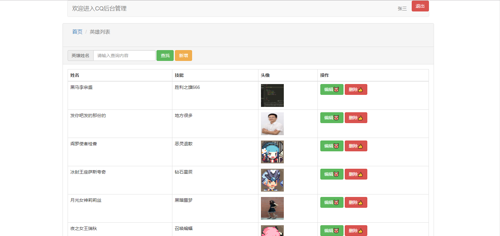
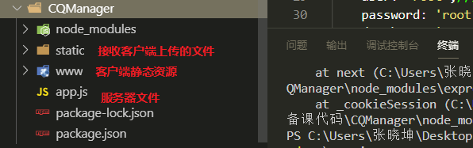
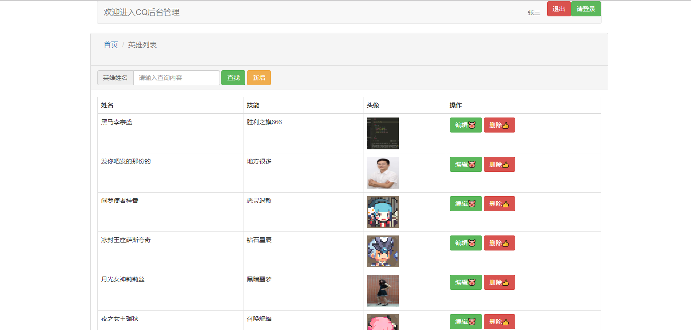
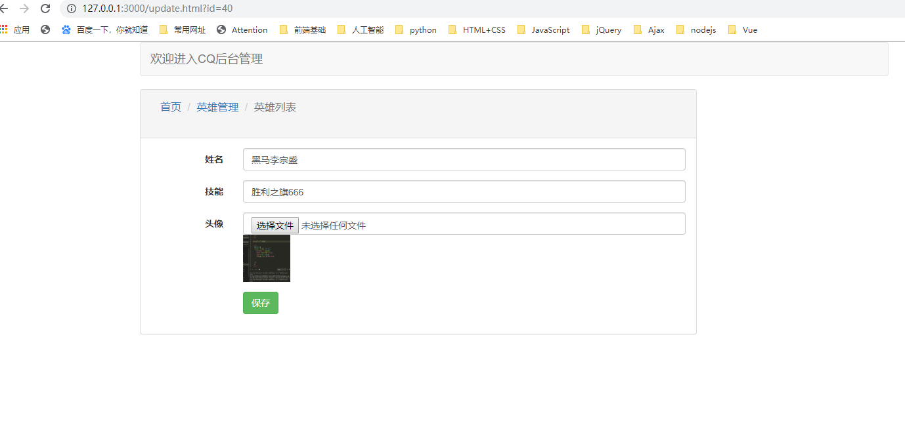

# 01 - CQManager综合项目介绍






* 1.开发环境
  * Nodejs平台+express框架+mysql数据库搭建服务端平台
* 2.技术栈
  * 1.搜索功能
  * 2.文件上传
  * 3.验证码功能
  * 4.登录注册加密流程
  * 5.用户会话保持原理及流程
* 3.项目开发流程介绍
  * 1.express框架搭建服务器入口文件
    * 1.导入模块
    * 2.创建服务器
    * 3.配置中间件
      * 托管静态资源
      * body-parser：解析post请求参数
      * express-fileupload:文件上传
      * mysql-ithm：数据库操作
      * cookie-session中间件：用户会话保持
    * 4.开启服务器
  * 3.设计路由（接口文档）
  * 4.处理
    * 请求：获取请求参数
    * 处理：增删改查数据库
    * 响应：将数据库操作结果响应给客户端


| 服务器说明            | 作用描述                     |
| --------------------- | ---------------------------- |
| http://127.0.0.1:3000 | 服务器基地址                 |
| 200                   | 请求成功 状态码              |
| 401                   | 用户名已存在 或者 用户名错误 |
| 402                   | 密码 错误  或者  验证码错误  |
| 500                   | 服务器内部错误               |
| 302                   | 服务器重定向                 |


| 接口名称     | URL            | 请求方式 | 请求参数                         | 返回值                      |
| ------------ | -------------- | -------- | -------------------------------- | --------------------------- |
| 查询英雄列表 | /hero/list     | get      | search : 英雄名称，不传返回所有  | [heros:{英雄列表}]          |
| 查询英雄详情 | /hero/info     | get      | id : 英雄id                      | {data:英雄详情}             |
| 编辑英雄     | /hero/update   | post     | name , skill , icon , id         | {code : 200)                |
| 删除英雄     | /hero/delete   | post     | id                               | {code:200}                  |
| 新增英雄     | /hero/add      | post     | name , skill , icon              | {code:200}                  |
| 验证码       | /captcha       | get      | 无                               | 验证码图片                  |
| 用户注册     | /user/register | post     | username, password , code:验证码 | {code : 200 \| 401 \| 402 } |
| 用户登录     | /user/login    | post     | username, password               | {code : 200\|401\|402}      |
| 退出登录     | /logout        | get      | 无                               | 无                          |


# 02-express搭建服务器

```javascript
//1.导入模块
const express = require('express');
//2.创建服务器
let app = express()

//3.配置中间件

//3.1 托管静态资源
app.use(express.static('www'));//静态网页
app.use(express.static('static'));//英雄图像

//3.2 body-parser：解析body
var bodyParser = require('body-parser');
// parse application/x-www-form-urlencoded
//以后所有的req都会有一个body属性，就是解析好的post参数对象
app.use(bodyParser.urlencoded({ extended: false }));

//3.3 express-fileupload：接收文件数据
const fileUpload = require('express-fileupload');
app.use(fileUpload());

//3.4  mysql-ithm数据库操作
//(1)导包
const hm = require('mysql-ithm');
//(2)连接数据库
hm.connect({
    host: 'localhost',//数据库地址
    port: '3306',
    user: 'root',//用户名，没有可不填
    password: 'root',//密码，没有可不填
    database: 'cqmanager'//数据库名称
});
//(3)创建Model(表格模型：负责增删改查)
//英雄表格
let heroModel = hm.model('heros', {
    name: String,
    skill: String,
    icon: String,
});


//4.设计路由（接口文档）

//(1)查询英雄列表
app.get('/hero/list', (req, res) => {
});

//(2)查询英雄详情
app.get('/hero/info', (req, res) => {
});

//(3)编辑英雄
app.post('/hero/update', (req, res) => {
});

//(4)删除英雄
app.post('/hero/delete', (req, res) => {
});

//(5)新增英雄
app.post('/hero/add', (req, res) => {
});

//(6)验证码
app.get('/captcha', (req, res) => {
});

//(7)注册
app.post('/user/register', (req, res) => {
});

//(8)登录
app.post('/user/login', (req, res) => {
});

//(9)退出登录
app.get('/logout', (req, res) => {
});

//5.开启服务器
app.listen(3000, () => {
    console.log('欢迎来到CQ荣耀');
});
```


# 03-完成查询英雄列表功能



## 1.1- 服务端代码

* `注意点`
  * 根据英雄名字查询数据库  需要使用sql的模糊查询
    * `name like %名字%` : name包含名字的
    * 不能使用 `name = 名字` ： 查询具体名字

```javascript
//(1)查询英雄列表
app.get('/hero/list', (req, res) => {
    //1.请求 : 获取参数search
    let search = req.query.search;
    //2.处理:查询数据库
    let str = '';
    if (search) {
        //如果客户端传了search，则使用mysql模糊查询
        str = `name like "%${search}%"`;
    } else {
        //如果客户端没有传search，则查询hero表格所有字段
        str = ['name', 'skill', 'icon', 'id'];
    };
    heroModel.find(str, (err, results) => {
        //3.响应
        if (err) {
            res.send({
                code: 500,
                msg: err
            });
        } else {
            res.send({
                code: 200,
                heros: results,
            });
        }
    });

});
```


## 1.2- 客户端代码：index.html

* `注意点`
  * 编辑按钮 ：使用window.location.href 给编辑页面传参id
  * 删除按钮 ：使用自定义属性 data-id 存储英雄id

```javascript
<script>
    //入口函数
    $(function () {
      //1.查询按钮点击事件
      $('#searchBtn').click(function (e) {
        //阻止表单默认跳转
        e.preventDefault();
        //ajax请求
        $.ajax({
          url: 'http://127.0.0.1:3000/hero/list',
          type: 'get',
          dataType: 'json',
          data: {
            search: $('#search').val()
          },
          success: function (backData) {
            console.log(backData);
            //数据响应之后 模板引擎渲染页面
            $('#heroListBody').html(template('hero_list', backData));
          }
        });
      });

      //页面一加载默认点击查询按钮
      $('#searchBtn').click();

  
    });
  </script>
```

```html
<!-- 英雄列表模板引擎 -->
  <script id="hero_list" type="text/html">
    {{ each heros v}}
    <tr>
      <td>{{ v.name}}</td>
      <td></td>
      <td></td>
      <td class="manager">
          <button class="btn btn-success" onclick="location.href='./update.html?id={{ v.id }}'" >编辑🐷</button>
          <button class="btn btn-danger btn-delete" data-id={{ v.id }}>删除👍</button>
      </td>
    </tr>
    {{ /each }}
  </script>
```


# 04-完成查询英雄详情功能



## 1.1-服务端代码

* `注意点`：
  * 数据库操作结果results一定是一个数组，如果想要返回客户端一个英雄对象，则需要取下标

```javascript
//(2)查询英雄详情
app.get('/hero/info', (req, res) => {
    //1.请求 : 获取参数id
    let id = req.query.id;
    //2.处理:查询数据库
    heroModel.find(`id=${id}`, (err, results) => {
        //3.响应
        if (err) {
            res.send({
                code: 500,
                msg: err
            });
        } else {
            res.send({
                code: 200,
                data: results[0]
            });
        }
    });
});
```


## 1.2-客户端代码：update.html

```html
<script>
    //入口函数
    $(function () {

      //1.获取从index.html 传递的参数英雄id
      let id = window.location.href.split('=')[1];

      //2.查询英雄详情
      $.ajax({
        url: 'http://127.0.0.1:3000/hero/info',
        type: 'get',
        dataType: 'json',
        data: {
          id: id
        },
        success: function (backData) {
          console.log(backData);
          //渲染页面
          $('#name').val(backData.data.name);
          $('#skill').val(backData.data.skill);
          $('#id').val(backData.data.id);
          $('#iconImg').attr('src', backData.data.icon);
        }
      });
    });
  </script>
```


# 05-完成编辑英雄功能

## 1.1-服务端代码

* `注意点`
  * 1.接收文件需要使用express-fileupload插件
  * 2.数据库只存储图片的路径字符串，具体的图片文件存储在static/imgs文件夹中
  * 3.图片文件名   使用 `英雄名字.png` 格式存储

```javascript
//(3)编辑英雄
app.post('/hero/update', (req, res) => {
    //请求 ： 获取参数 文件 + 文本
    console.log(req.files);
    console.log(req.body);
    let icon = req.files.icon;
    let { name, skill, id } = req.body;
    //处理 ：文件存入static 文本存入数据库  (图片名称格式 ：  英雄姓名.png )
    icon.mv(__dirname + '/static/imgs/' + name + '.png', function (err) {
        if (err) {
            //响应
            res.send({
                code: 500,
                msg: err
            });
        }
    });
    //数据库存储的是文件的url路径
    heroModel.update(`id=${id}`, {
        name,
        skill,
        icon: '/imgs/' + name + '.png'
    }, (err, results) => {
        //响应
        if (err) {
            res.send({
                code: 500,
                msg: err
            });
        } else {
            res.send({
                code: 200,
                msg: '编辑成功'
            });
        }
    });
});
```


## 1.2-客户端代码 : update.html

```javascript
//3.文件预览
      //1.给file表单元素注册onchange事件
      $('#icon').change(function () {
        //1.2 获取用户选择的图片
        var file = this.files[0];
        //1.3 将文件转为src路径
        var url = URL.createObjectURL(file);
        //1.4 将url路径赋值给img标签的src
        $('#iconImg').attr('src', url);
      });

      //4.编辑英雄
      $('.btn-save').on('click', function (e) {
        //禁用表单默认提交事件
        e.preventDefault();
        //创建FormData对象：参数是表单dom对象
        var fd = new FormData($('#form')[0]);
        $.ajax({
          url: 'http://127.0.0.1:3000/hero/update',
          type: 'post',
          dataType: 'json',
          data: fd,
          contentType: false,
          processData: false,
          success: function (backData) {
            console.log(backData);
            if (backData.code == 200) {
              alert('编辑成功');
              window.location.href = './index.html';
            }

          }
        });
      });
```


#  06-完成删除英雄功能

## 1.1-服务端代码

```javascript
//(4)删除英雄
app.post('/hero/delete', (req, res) => {
    //1.请求 ： 获取参数 id
    console.log(req.body);
    let id = req.body.id;
    //2.处理 ： 删除数据
    heroModel.delete(`id=${id}`, (err, results) => {
        //3.响应
        if (err) {
            res.send({
                code: 500,
                msg: err
            });
        } else {
            res.send({
                code: 200,
                msg: '删除成功'
            });
        }
    });
});
```


## 1.2-客户端代码：index.html

* `注意点`
  * 删除按钮是ajajx动态生成，需要注册委托事件

```javascript
//2.删除按钮点击事件 : ajax动态添加元素需要注册委托事件
      $('body').on('click', '.btn-delete', function () {
        $.ajax({
          url: 'http://localhost:3000/hero/delete',
          type: 'post',
          dataType: 'json',
          data: {
            id: $(this).attr('data-id')
          },
          success: function (backData) {
            if (backData.code == 200) {
              alert('删除成功');
              window.location.reload();
            }
          }
        });
      });
```


# 07-完成新增英雄功能


## 1.1-服务端代码

```javascript
//(5)新增英雄
app.post('/hero/add', (req, res) => {
    //1.请求 ： 获取参数 文件 + 文本
    console.log(req.files);
    console.log(req.body);
    let icon = req.files.icon;
    let { name, skill } = req.body;
    //2.处理 ：文件存入static 文本存入数据库  (图片名称格式 ：  英雄姓名.png )
    icon.mv(__dirname + '/static/imgs/' + name + '.png', function (err) {
        if (err) {
            //响应
            res.send({
                code: 500,
                msg: err
            });
        }
    });
    //数据库存储的是文件的url路径
    heroModel.insert({
        name,
        skill,
        icon: '/imgs/' + name + '.png'
    }, (err, results) => {
        //3.响应
        if (err) {
            res.send({
                code: 500,
                msg: err
            });
        } else {
            res.send({
                code: 200,
                msg: '新增成功'
            });
        }
    });
});
```


## 1.2-客户端代码

```html
<script>
    //入口函数
    $(function () {

      //1.文件预览
      //1.给file表单元素注册onchange事件
      $('#icon').change(function () {
        //1.2 获取用户选择的图片
        var file = this.files[0];
        //1.3 将文件转为src路径
        var url = URL.createObjectURL(file);
        //1.4 将url路径赋值给img标签的src
        $('#iconImg').attr('src', url);
      });

      //2.编辑英雄
      $('.btn-insert').on('click', function (e) {
        //禁用表单默认提交事件
        e.preventDefault();
        //创建FormData对象：参数是表单dom对象
        var fd = new FormData($('#form')[0]);
        $.ajax({
          url: 'http://localhost:3000/hero/add',
          type: 'post',
          dataType: 'json',
          data: fd,
          contentType: false,
          processData: false,
          success: function (backData) {
            console.log(backData);
            if (backData.code == 200) {
              alert('新增成功');
              window.location.href = './index.html';
            }

          }
        });
      });
    });
  </script>
```

