# 01-完成验证码功能(svg-captcha第三方模块)

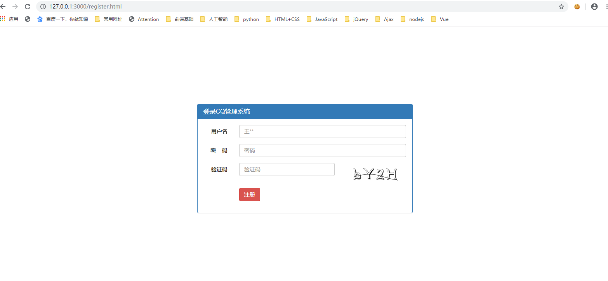

* 验证码功能思路
  * 1.服务端生成一个二进制验证码`图片文件`与对应的`验证码文本`
  * 2.服务端声明全局变量存储验证码文本（用于客户验证）
  * 3.客户端img标签发起网络请求，服务端响应验证码图片
  * 4.客户端提交注册数据，服务端处理

* svg-captcha第三方模块: https://www.npmjs.com/search?q=svg-captcha


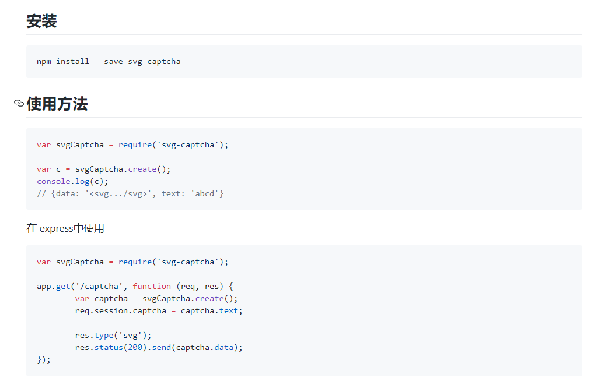

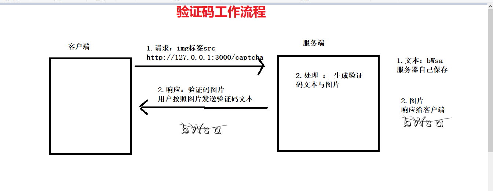

## 1.1-服务端代码（生成验证码并返回验证码图片）

```javascript
//(6)验证码
//声明全局变量存储验证码问题 （用于客户端验证）
let captchaTxt = '';
app.get('/captcha', (req, res) => {
    //1.创建验证码对象
    var captcha = svgCaptcha.create();
    //2.获取验证码文本并保存
    captchaTxt = captcha.text;
    console.log(captcha.text);
    //3.将验证码图片响应给客户端
    res.type('svg');
    res.status(200).send(captcha.data);
});
```


## 1.2-客户端：register.html

* img标签src属性请求图片，服务器响应之后img标签会自动加载图片

```html

```


# 02-完成加密功能(md5加密与加盐技术)

* 数据加密思路
  * 1.客户端点击提交的时候对密码进行md5加密（使用前端第三方包 md5.min.js）
  * 2.服务端接收到密文保存到数据库
    * 密码明文只存在于用户填写的表单input中(不要在代码里面去打印用户明文，避免泄露)
    * 无论是网络传输还是服务器都只存储密文
      * 防止http请求被攻击导致密码泄露
      * 防止数据库被攻击导致密码泄露
    * 下一次用户登录的时候，使用相同加密方式对登录密码进行加密。然后服务端只匹配两个密文是否一致

## 1.1-客户端：register.html

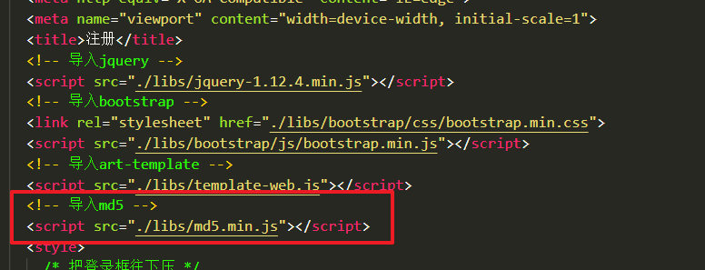


* `细节知识点`
  * jq有一个自带的`serialize()`方法，作用是自动将form表单的input的name与value拼接成键值对
    * 官网传送门：http://jquery.cuishifeng.cn/serialize.html
  * `$(form表单).serialize()` 与  `new FormData(fom表单区别)`
    * serialize() : 用来传输`文本数据`的（自己一个个拼接太麻烦，用这个简写）
    * FormData():用来传输`文件数据`的  （如果要上传文件，就只能用formdata）

```html
<script>
    $('#register').on('click', function (e) {
      //1.禁用表单默认提交事件
      e.preventDefault();
      //2.对密码进行md5加密
      //第一个参数，要加密的字符串。 第二个参数：加盐（额外添加数据，让加密更加安全）
      let md5String = md5($('#password').val(), 'add salt');
      //3.加密之后重新赋值给表单的文本，否则serialize提交的还是未加密的密码
      $('#password').val(md5String);
      $.ajax({
        url: 'http://127.0.0.1:3000/user/register',
        type: 'post',
        dataType: 'json',
        data: $('#form').serialize(),
        success: function (data) {
          // code: 200 成功   401：用户已注册  402：验证码错误  500：服务器内部错误
          if (data.code == 200) {
            alert('注册成功');
            location.href = './login.html';//跳转登录
          } else {
            alert(data.msg);
          };
        }
      });
    });
  </script>
```

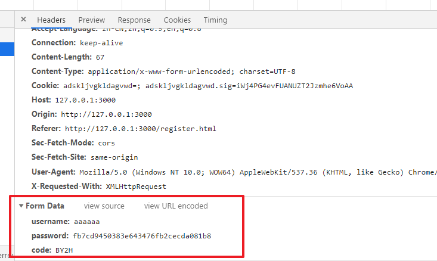

# 03-完成注册功能

* 服务端处理注册业务逻辑
  * （1）先检查验证码是否正确
  * （2）再检查这个用户是否已经注册
  * （3）注册信息插入数据库
  * code: 200 成功   401：用户已注册  402：验证码错误  500：服务器内部错误

## 1.1-服务端代码

* `注意点`
  * 验证码不要直接比较，应该将服务器生成的验证码与用户上传的code全部转为小写
    * 验证码一般不区分大小写

```javascript
//(7)注册
app.post('/user/register', (req, res) => {
    //1.获取post请求参数
    let body = req.body;
    console.log(body);
    //2.处理
    // code: 200 成功   401：用户已注册  402：验证码错误  500：服务器内部错误
    if (body.code.toLowerCase() != captchaTxt.toLowerCase()) { //全部转小写，不区分大小写
        //验证码错误
        res.send({
            code: 402,
            msg: '验证码错误'
        });
    } else {
        //检查是否已经注册
        userModel.find(`username="${body.username}"`, (err, results) => {
            if (err) {
                res.send({
                    code: 500,
                    msg: '注册失败'
                });
            } else if (results.length != 0) {
                res.send({
                    code: 401,
                    msg: '用户已存在'
                });
            } else { //如果没有注册，则添加到数据库
                userModel.insert({
                    username: body.username,
                    password: body.password
                }, (err, results) => {
                    if (err) {
                        res.send({
                            code: 500,
                            msg: '注册失败'
                        });
                    } else {
                        res.send({
                            code: 200,
                            msg: 'success'
                        });
                    }
                })
            }
        });
    }
});
```


# 04-完成登录功能

登录功能思路

* 1.客户端对密码加密然后post提交
* 2.服务器接收参数
* 3.服务器处理
  * 1.先查询数据库判断用户名是否存在
  * 2.如果存在则匹配密码是否与注册的时候一致
  * // code: 200 成功   401：用户名错误 402：密码错误  500：服务器内部错误

## 1.1-客户端: login.html

```html
<script>
    $('.btn-login').on('click', function (e) {
      //禁用表单默认提交事件
      e.preventDefault();
      //对密码进行md5加密
      //第一个参数，要加密的字符串。 第二个参数：加盐（额外添加数据，让加密更加安全）
      let md5String = md5($('#password').val(), 'add salt');
      //加密之后重新赋值给表单的文本，否则serialize提交的还是未加密的密码
      $('#password').val(md5String);
      $.ajax({
        url: 'http://127.0.0.1:3000/user/login',
        type: 'post',
        dataType: 'json',
        data: $('#form').serialize(),
        success: function (data) {
          // code: 200 成功   401：用户名错误 402：密码错误  500：服务器内部错误
          if (data.code == 200) {
            alert('登录成功');
            location.href = './index.html'; //跳转首页
          } else {
            alert(data.msg);
          };
        }
      });
    });
  </script>
```


## 1.2-服务端

```javascript
//(8)登录
app.post('/user/login', (req, res) => {
    //1.获取post请求参数
    let body = req.body;
    console.log(body);
    //2.处理请求
    // code: 200 成功   401：用户名错误 402：密码错误  500：服务器内部错误
    //2.1 先检查用户名在不在
    userModel.find(`username="${body.username}"`, (err, results) => {
        if (err) {
            res.send({
                code: 500,
                msg: err
            });
        } else if (results.length == 0) { //用户不存在
            res.send({
                code: 401,
                msg: '用户名或密码错误'
            });
        } else {
            //2.2 检查密码是否正确
            let user = results[0]; //如果可以查询到，则数组第一个元素就是用户数据
            console.log(body);
            console.log(user);
            if (user.password != body.password) {
                res.send({
                    code: 402,
                    msg: '用户名或密码错误'
                });
            } else {
                //用户存在且密码一致，登录成功
                res.send({
                    code: 200,
                    msg: 'success'
                });
            }
        };
    });
});
```


# ==05-cookie-session用户会话保持==

## 1.1-什么是Cookie？

* 1.cookie的定义：Cookie，有时也用其复数形式 Cookies，指某些网站为了辨别用户身份、进行 session 跟踪而储存在用户本地终端上的数据（通常经过加密）
    * Cookie最早是网景公司的前雇员Lou Montulli在1993年3月的发明
    * Cookie是由服务器端生成，发送给User-Agent（一般是浏览器），浏览器会将Cookie的key/value保存到某个目录下的文本文件内，下次请求同一网站时就发送该Cookie给服务器（前提是浏览器设置为启用cookie）。Cookie名称和值可以由服务器端开发自己定义，对于JSP而言也可以直接写入jsessionid，这样服务器可以知道该用户是否是合法用户以及是否需要重新登录等，服务器可以设置或读取Cookies中包含信息，借此维护用户跟服务器会话中的状态。

* 2.cookie的状态管理
    * HTTP 是无状态协议，它不对之前发生过的请求和响应的状态进行管理。也就是说，无法根据之前的状态进行本次的请求处理。
        * 任何浏览器都可以访问服务器，服务器根本不知道到底是哪一个用户访问自己
    * 假设要求登录认证的 Web 页面本身无法进行状态的管理（不记录已登录的状态），那么每次跳转新页面不是要再次登录，就是要在每次请求报文中附加参数来管理登录状态。
        * 不可否认，无状态协议当然也有它的优点。由于不必保存状态，自然可减少服务器的 CPU 及内存资源的消耗。从另一侧面来说，也正是因为 HTTP 协议本身是非常简单的，所以才会被应用在各种场景里。

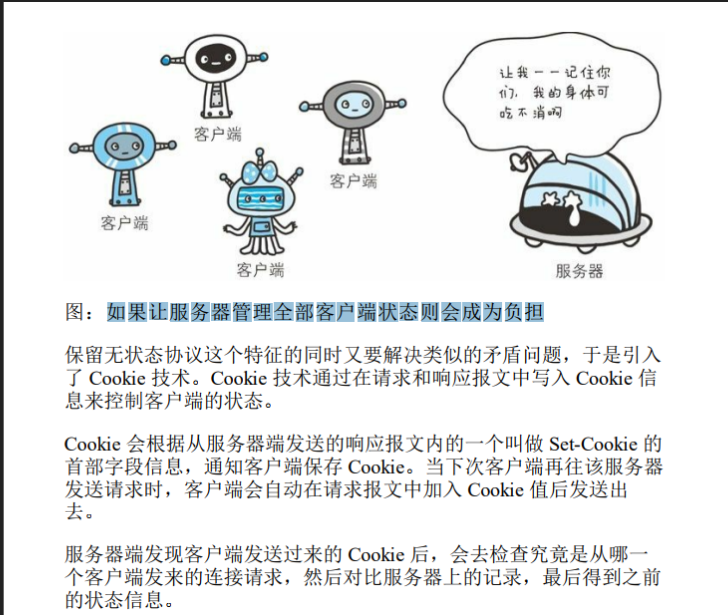


## 1.2-Cookie的工作原理

* 1.当一个用户第一次访问浏览器时，服务器会生成一个cookie，并且在响应头中添加cookie后返回给浏览器
* 2.浏览器会自动将cookie保存在下次，当下一次访问同一服务器时会自动将cookie放入请求头中发给服务器，这样服务器就可以识别用户
    * （1）每一个服务器都有自己的cookie（cookie的域名识别）

    * （2）cookie是由服务器生成的

        * 虽然浏览器本身也可以添加cookie，但是保持用户状态的cookie一定是由服务器生成的（seesion）

    * （3）浏览器访问同一域名的请求时会自动将cookie发给服务器，我们开发人员无需编写任何代码
        * 如果有则发送，没有则不发
        * cookie是在请求头中的


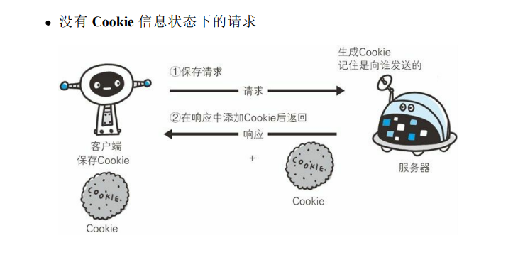

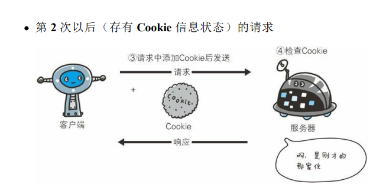

```javascript

// 只要在响应头中加入 Set-Cookie 字段，客户端会把这个数据放到一个文件中然后保存到客户端电脑上
//服务器响应头添加cookie发给浏览器
  res.writeHead(200, {
    'Content-Type': 'text/plain; charset=utf-8',
    "Set-Cookie": 'userid=123456'
  })

```

## 1.3-Cookie的与session的关系

* cookie的本质就是一个字符串，通常我们会以`key=value`的形式来记录用户状态，而seesion可以理解为就是这个键值对中的某一个键值对，下图可以很好的说明cookie与session之间的关系
    * 其实session本身只是一个抽象的概念：在cookie中添加一个键值对专用于记录用户登陆状态的这种思想。
        * 你可以使用任何键值对来表示这种登陆状态，只是大家一个规范喜欢把这个键值对的键叫做`session`，不同的网站会有不同的名称，但是一般都会有`session`这个单词
* `总结说人话` ： cookie是一个对象，里面有很多属性，用于存储数据（存储购物车，网站访问记录，登录信息等）。 其中用于记录用户登录状态的那个就叫做session

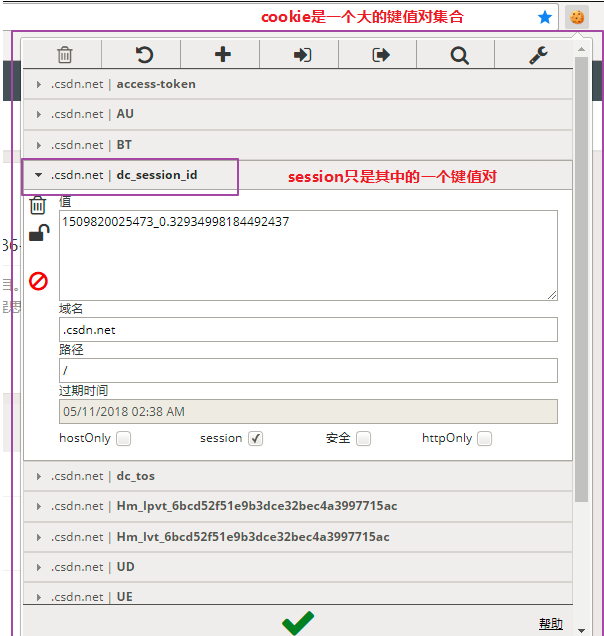


## 1.4-举个栗子你就知道cookie和session的区别了

* 在下图看病过程中，用户相当于浏览器，医院相当于服务器
    * 1.用户第一次去医院看病时，是空手去的，医院并不知道你是谁，你要干什么
        * 浏览器第一次访问服务器，由于http是无状态协议，所以服务器无法识别用户
    * 2.看完病之后，医生会给你一个病历本或者就诊卡，上面记录了你的一些个人信息，如姓名、年龄、症状等，每一个病历本都有一个病历号，医生将你的信息录入医院管理系统之后就把病历本给你的（病历本不是你和医院一人一份，而是你一个人持有）
        * 服务器在响应头中添加cookie（病历本），并且保存用户的session（病历号）
            * cookie是放在浏览器保存的，session是服务器和浏览器同时保存
    * 3.下一次我们再去同一医院时，就会带上我们的病历本，此时医生只需要根据你的病历号查询医院管理系统就知道上一次给你记录的个人信息
        * 浏览器下一次访问相同域名的服务器时会自动带上cookie，服务器获取cookie中的session就可以知道用户的登陆状态
            * 这里说的服务器不保存cookie是指不会以cookie的方式去保存，服务器会有一个专门的数据库来保存cookie上的信息（病人管理系统），也就是说医院的病人管理系统虽然记录了你的病历本上的数据，但它不是病历本（cookie）

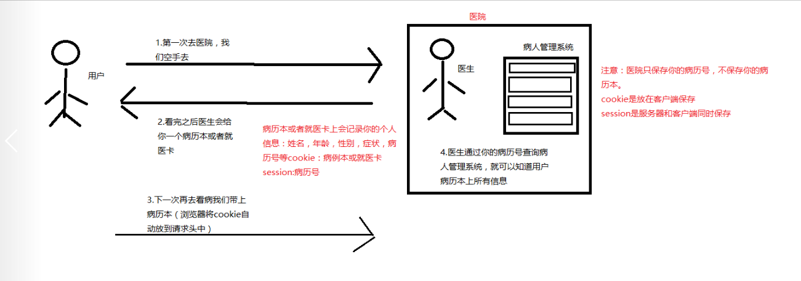


## 1.5-使用sessioc保持用户登录状态的完整流程


* **`cookie-seesion不需要前端做任何事`**
  * 1.服务端接收到登录请求之后，将登录信息写入cookie，发给客户端
  * 2.浏览器接收到服务器的cookie之后，自动存储到本地。
  * 3.下一次浏览器访问相同域名的服务器时，会自动将该网站cookie上传
    * 哪怕你谷歌浏览器关闭重启也会发送，因为cookie被浏览器写入本地文件去了
  * 4.服务器接收到客户端请求的时候，只需要获取cookie中的session就知道这个浏览器有没有登陆过，登录哪个用户了
    * 如果有登录，则将session响应给客户端。客户端根据需求修改页面UI即可


## 1.6-使用cookie-session实现用户会话保持

http://www.expressjs.com.cn/en/resources/middleware/cookie-session.html


* 安装：`cnpm i cookie-session --save`


### 1.app.js中配置中间件

```javascript
//3.5 cookie-session中间件：用户会话保持
var cookieSession = require('cookie-session')
app.set('trust proxy', 1) // trust first proxy 信任首次登录陌生用户
app.use(cookieSession({
    name: 'session',
    keys: ['11111'],//设置加密的钥匙
    // Cookie Options
    maxAge: 24*60*60*1000 // 24 hours 有效期
}));
```


### 2.服务端用户登录成功时，则将该信息写入cookie

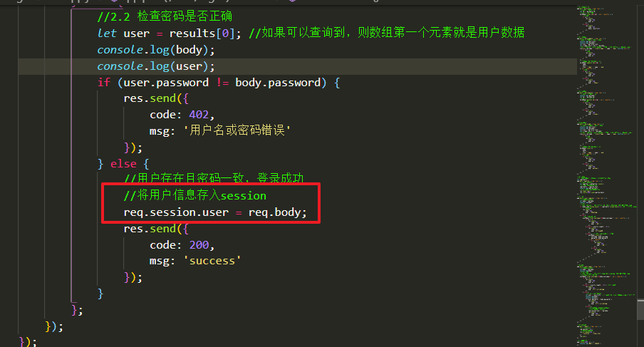

* ***从此浏览器以后再访问服务器会自动将cookie放到请求头中发给服务器***

  * 前端不用写一行代码

    

  

###   3.服务端请求英雄列表时，响应session信息（告诉客户端是否登录）

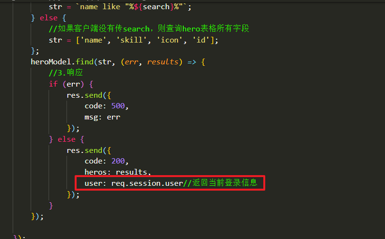


### 4.客户端index.html中根据cookie来修改页面

```javascript

 //1.查询按钮点击事件
      $('#searchBtn').click(function (e) {
        e.preventDefault();
        $.ajax({
          url: 'http://127.0.0.1:3000/hero/list',
          type: 'get',
          dataType: 'json',
          beforeSend: function (xhr) {
            xhr.withCredentials = true;
          },
          data: {
            search: $('#search').val()
          },
          success: function (backData) {
            console.log(backData);
            $('#heroListBody').html(template('hero_list', backData));
            //根据用户登录状态显示不同的界面
            if (backData.user) {//已经登录
              $('#username').text(backData.user.username);/*  */
              $('#login').hide();
            } else {//未登录
              $('#username').hide();
              $('#logout').hide();
            }
          }
        });
      });
```


# 06-完成退出登录功能

* 重定向技术实现退出登录流程

  * (1)客户端发送退出登录请求 : `http://127.0.0.1:3000/logout`

  * (2)服务器接收请求
    * a. 清空该用户cookie
    * b. 重定向刷新首页

## 1.1-客户端 : index.html

```html
<li><button class="btn btn-danger btn-exit" id="logout" onclick="location.href='/logout'">退出</button></li>
```


## 1.2-服务端

```javascript
//(9)退出登录
app.get('/logout', (req, res) => {
    //1.清空session
    req.session = null;
    //2.重定向显示首页
    res.writeHead(302, {
        'Location': './index.html'
    });
    res.end();
});
```

