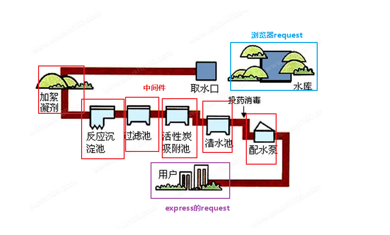
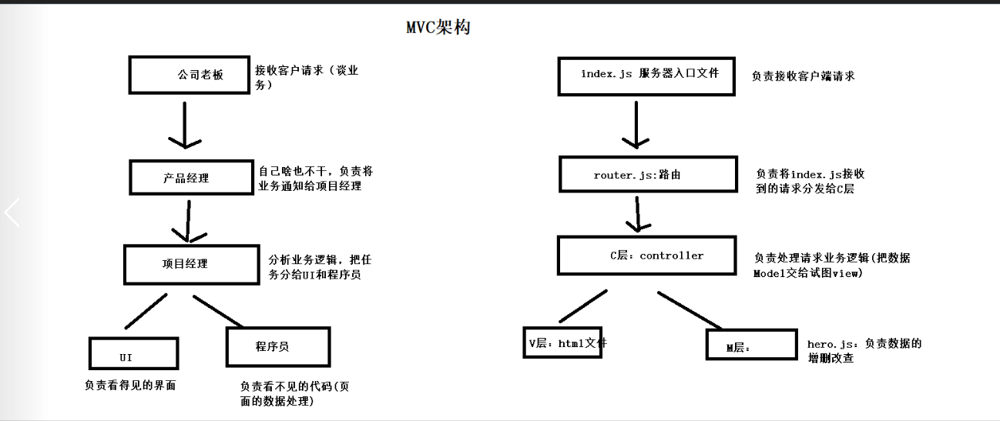
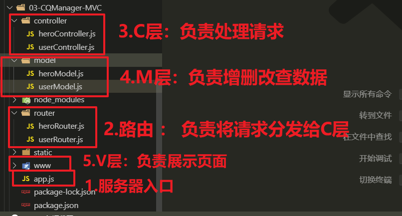
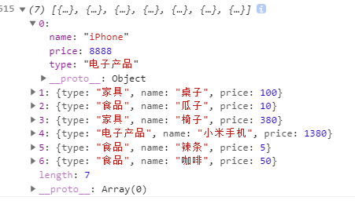
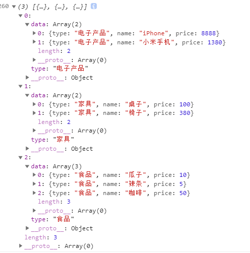

# ==01-Promise(ES6中的难点)==

## 1.1-Promise介绍

* ES6教程传送门：http://es6.ruanyifeng.com/#docs/promise
* 1.Promise是什么？
  * Promise `是` 一个 `构造函数`, 用于创建Promise对象
    * Promise对象：可以理解为一个处理异步操作的容器
* 2.Promise作用：解决回调地狱
  * 回调地狱：异步回调 层层嵌套

```javascript
/* 
为什么要学习Promise？

1.Promise作用 ： 解决回调地狱问题
    回调地狱 ： 异步回调 层层嵌套
*/

//需求： 依次读取 文件  a.txt , b.txt , c.txt 这三个文件内容
const fs = require('fs');

//（1）能直接按照顺序写吗？  : 不能，因为异步操作 是无序的
fs.readFile("./data/a.txt", 'utf-8', (err, data) => {
    if(err){
        console.log(err);
    }else{
        console.log(data);
    };
});

fs.readFile("./data/b.txt", 'utf-8', (err, data) => {
    if(err){
        console.log(err);
    }else{
        console.log(data);
    };
});

fs.readFile("./data/c.txt", 'utf-8', (err, data) => {
    if(err){
        console.log(err);
    }else{
        console.log(data);
    };
});


//（2）解决方案 ： 在回调函数中嵌套执行
//弊端 ： 形成回调地狱（异步回调 层层嵌套，非常麻烦且不便于维护）
//读取文件A
fs.readFile("./data/a.txt", 'utf-8', (err, data) => {
    if(err){
        console.log(err);
    }else{
        console.log(data);
        //A读取成功之后开始读取B
        fs.readFile("./data/b.txt", 'utf-8', (err, data) => {
            if(err){
                console.log(err);
            }else{
                console.log(data);
                //B读取成功之后开始读取C
                fs.readFile("./data/c.txt", 'utf-8', (err, data) => {
                    if(err){
                        console.log(err);
                    }else{
                        console.log(data);
                    }
                });
            }
        });
    }
});

```


## 1.2-Promise基本使用

* 1.实例化Promise对象
  * 作用： 将异步操作代码 放入 Promise中
    * resolve：异步操作 成功状态
    * reject : 异步操作 失败状态
  * `new Promise((resolve,reject)=>{ 你的异步操作 })`
* 2.调用`then()`方法处理异步操作结果
  * ` promise对象.then((data)=>{ 处理成功数据 },(err)=>{ 处理失败信息 });`

```javascript
/* 
1.Promise是一个构造函数 ， 返回一个Promise对象
2.使用流程
    (1)实例化Promise对象 ： 将异步操作放入Promise中
    (2)调用then() 方法： 处理异步操作结果
*/

const fs = require('fs');
/** 1. 实例化Promise
* @description:实例化Promise
* @param {Function}  (resolve：成功处理函数,reject：失败处理函数)=>{ 异步操作代码 }
* @return: Promise对象
*/
 const p1 = new Promise((resolve,reject)=>{
     //读文件
     fs.readFile('./data/a.txt','utf8',(err,data)=>{
        if(err == null){ 
            /* 
            (1)异步操作成功，则执行 resolvce()
            (2)resolve会把把promise对象的状态从 pending进行中 改为 fulfilled成功
            (3)该方法本质是调用 then() 中的第一个方法
            */
            resolve(data);
        }else {
            /* 
            (1)异步操作失败，则执行 reject()
            (2)reject会把把promise对象的状态从 pending进行中 改为 rejected失败
            (3)该方法本质是调用 then() 中的第二个方法
            */
            reject(err); 
        }
     });
 });

 /* 2. p1.then() : 处理异步操作结果 */
 p1.then((data)=>{
    //成功了,打印文件数据
    console.log(data);
 },(err)=>{
    //失败了,打印错误信息
    console.log(err);
 });
```


## 1.3-Promise特点介绍(原理篇)

**promise本质 `不是控制` 异步代码的`执行顺序`（无法控制） ， `而是控制`异步代码结果`处理的顺序`**

```javascript
/**
 * 1.promise对象有三个状态.
    a. pending（进行中）
    b. fulfilled（已成功）
    c. rejected（已失败）
 
 * 2.Promise对象的状态改变， 只有两种可能：
    a. 从pending变为fulfilled
        * 此时应该执行 resolve();
    b. 从pending变为rejected。
        * 此时应该执行 reject();
 
 * 3.promise在创建对象的时候,里面的代码会执行.
    a. promise创建时，里面的代码还是异步无序操作
    b. promise的原理是，利用then方法将异步操作的结果 按照顺序执行
    *** 总结： 不要在创建promise的时候去处理异步操作结果，而应该通过 then() 方法来处理 ***

 * 4.promise解决回调地狱原理 ： 在then方法中返回一个promise对象
    *** 在上一个promise的then方法中，返回下一个promise ***

 * 5.坤哥结语 ： promise本质 不是控制异步代码的执行顺序（无法控制） ， 而是控制异步代码结果处理的顺序
*/

const fs = require('fs');

//(1) 创建三个异步操作  promise

//读取文件A
const p1 = new Promise((resolve,reject)=>{
    //读文件
    fs.readFile('./data/a.txt','utf8',(err,data)=>{
       if(err == null){ 
            //成功
           resolve(data);
       }else {
           //失败
           reject(err); 
       }
    });
});

//读取文件B
const p2 = new Promise((resolve,reject)=>{
    //读文件
    fs.readFile('./data/b.txt','utf8',(err,data)=>{
       if(err == null){ 
            //成功
           resolve(data);
       }else {
           //失败
           reject(err); 
       }
    });
});

//读取文件C
const p3 = new Promise((resolve,reject)=>{
    //读文件
    fs.readFile('./data/c.txt','utf8',(err,data)=>{
       if(err == null){ 
            //成功
           resolve(data);
       }else {
           //失败
           reject(err); 
       }
    });
});

// (2)按照顺序处理异步操作结果
p1.then((data)=>{//第一个异步结果
    console.log(data);
    return p2;//返回下一个promise
}).then((data)=>{ // 第二个异步结果  （由于p1.then方法返回的是p2，而p2也有自己的then，所以可以继续调用p2的then方法）
    console.log(data);
    return p3;//返回下一个promise
}).then((data)=>{ // 第三个异步结果  
    console.log(data);
});


```


## 1.4-Promise解决回调地狱封装

```javascript
const fs = require('fs');


//1.封装一个函数 ：  根据文件名生成  文件读取的promise
function getPromise(fileName) {
    var p = new Promise((resolve, reject) => {
        //读文件
        fs.readFile(`./data/${fileName}.txt`,'utf-8', (err, data) => {
            if (err == null) {
                //成功
                resolve(data);
            } else {
                //失败
                reject(err);
            }
        });
    });
    return p;
};

//2.解决需求： 要先读a, 读完a后读b, 读完b后读c.

//开始读取a
getPromise('a').then((data)=>{
    console.log(data);
    //继续读取b
    return getPromise('b');
}).then((data)=>{
    console.log(data);
    //继续读取c
    return getPromise('c');
}).then((data)=>{
    console.log(data);
});//异步回调队列结束

```


## 1.5-Promise对象的catch方法

* catch:用于捕获异步操作的错误信息

```javascript
const fs = require("fs");

/* 
promise实例对象的catch方法 ： 用于捕获异步操作的错误信息
*/


//1.封装一个函数 ：  根据文件名生成  文件读取的promise
function getPromise(fileName) {
    var p = new Promise((resolve, reject) => {
        //读文件
        fs.readFile(`./data/${fileName}.txt`, 'utf-8', (err, data) => {
            if (err == null) {
                //成功
                resolve(data);
            } else {
                //失败
                reject(err);
            }
        });
    });
    return p;
};

//2.解决需求： 要先读a, 读完a后读b, 读完b后读c.

//开始读取a
getPromise('a').then((data)=>{
    console.log(data);
    //继续读取b
    return getPromise('b');
}).then((data)=>{
    console.log(data);
    //继续读取c
    return getPromise('c');
}).then((data)=>{
    console.log(data);
}).catch((err)=>{
    //以上三个异步操作，只要有任何一个出错，都会执行err
    console.log(err);
});

```


## 1.6-Promise对象的all方法

* all
  * 将多个Promise合并成一个Promise
  * 所有异步全部执行完毕才会执行then方法

```javascript
const fs = require("fs");

/* 
1. promise实例对象的all方法 ： 将多个Promise合并成一个Promise
    * 所有异步全部执行完毕才会执行then方法

2. 解决需求： a , b , c 同时执行完毕
*/


//1.封装一个函数 ：  根据文件名生成  文件读取的promise
function getPromise(fileName) {
    var p = new Promise((resolve, reject) => {
        //读文件
        fs.readFile(`./data/${fileName}.txt`, 'utf-8', (err, data) => {
            if (err == null) {
                //成功
                resolve(data);
            } else {
                //失败
                reject(err);
            }
        });
    });
    return p;
};

//2.解决需求： a , b , c 同时执行完毕
let pa = getPromise('a');
let pb = getPromise('b');
let pc = getPromise('c');
//将三个异步操作合并成一个Promise
let pAll = Promise.all([pa,pb,pc]);

//开始读取a
// 三个promise都成功后,才去执行pAll.then的第一个方法.
// 只要有一个失败了,就去执行catch里面的函数.
pAll.then((data)=>{
    console.log(data);//data是一个数组，存储每一个promise的成功结果
}).catch((err)=>{
    console.log(err);
});

```


## 1.7-Promise对象的race方法

* race
  * 将多个Promise合并成一个Promise
  * 任何一个异步  执行完毕就会执行then方法

```javascript
const fs = require("fs");

/* 
1. promise实例对象的race方法 ： 将多个Promise合并成一个Promise
    * 任何一个异步  执行完毕就会执行then方法

2. 解决需求： a , b , c 任意一个成功
*/


//1.封装一个函数 ：  根据文件名生成  文件读取的promise
function getPromise(fileName) {
    var p = new Promise((resolve, reject) => {
        //读文件
        fs.readFile(`./data/${fileName}.txt`, 'utf-8', (err, data) => {
            if (err == null) {
                //成功
                resolve(data);
            } else {
                //失败
                reject(err);
            }
        });
    });
    return p;
};

//2.解决需求： a , b , c 同时执行完毕
let pa = getPromise('a');
let pb = getPromise('b');
let pc = getPromise('c');
//将三个异步操作合并成一个Promise
let pAll = Promise.race([pa,pb,pc]);

//开始读取a
// 三个promise任何一个成功,就去执行pAll.then的第一个方法.  （一旦成功一个，其他不再执行）
pAll.then((data)=>{
    console.log(data);//data是第一个执行成功的primise异步结果
}).catch((err)=>{
    console.log(err);
});

```


# 02-Express中间件原理(了解)

* 中间件是Express框架学习中最难的部分，同时也是最为核心的技术，我们的学习路线如下
  * 1.nodejs自定义模块
  * 2.中间件工作原理介绍
  * 3.自定义中间件


## 1.1-Nodejs自定义模块

### 1-CommonJS规范介绍

* 官网传送门:<http://www.commonjs.org/>

* 1.世界上的编程规范有很多种，CommonJS只是其中一种
* 2.CommonJS规范不是只为Nodejs服务，有很多平台都遵循CommonJS规范，Nodejs平台只是其中之一
* 3.CommonJS规范只有三句话
  * 1.导入模块使用:`require()`
  * 2.导出模块使用:`module.exports`
  * 3.导出模块一定要使用:`module.exports`(重要是事说两遍)


```javascript
/* 1.每一个js文件都是一个独立的作用域，外部无法访问*/

let name = '张三';

let age = 18;

let sayHi = ()=>{
    console.log('我是张三');
};

/* 2.每一个js文件都有一个默认的全局对象 module.exports，
当外部使用 require() 导入这个js文件模块，就会得到这个module.exports对象 */
module.exports = {
    name,
    age
};
```


```javascript
/* 1.自定义模块：使用文件路径来导入 */
const mokuai = require('./mokuai.js');
console.log(mokuai);

/* 2.内置模块 ： 模块名导入 */
const http = require('http');

/* 3.第三方模块 ： 模块名导入 */
var bodyParser = require('body-parser');
```


### 2-Nodejs模块加载缓存机制

* 1.加载模块时，node会首先从缓存中查找，如果缓存中存在则从缓存中读取，如果不存在则读取并且放入缓存
* 2.也就是说，一个模块在第一次导入时会被node放入缓存中，第二次再导入不会重新加载而是从缓存中读取
  * （1）避免的重复导入模块的资源浪费
  * （2）从缓存中读取模块速度更快


```javascript
//nodejs模块缓存机制

/*每一个模块在第一次导入之后会被node放入缓存中，第二次导入不会重新加载而是从缓存中读取
    a.避免重复导入模块的资源浪费
    b.从缓存中读取模块速度更快
*/

//第一次加载：会执行模块中的代码，之后放入缓存中
const mokuai1 = require('./mokuai.js');

//第二次加载：直接从缓存中读取
const mokuai2 = require('./mokuai.js');


console.log(mokuai1 === mokuai2);//true


```

## 1.2-什么是中间件

* `中间件其实就是前端中jquery的插件，只不过在服务端换了一种高逼格叫法而已`
  * 还记得jquery怎么自定义中间件吗？： 给 $对象的原型添加方法
  * nodejs中自定义中间件的原理与前端类似，只是语法不同而已

* **下图是一个自来水净化的过程，这张图可以更好的理解什么是中间件**
* 水库的水并不是直接取出来就送到用户的家中使用，而是经过一些净化过滤处理之后才送到用户的家中，在这个过程中水还是水，本质上还是同一个东西，但是却多了一些东西
  * 水库中原始的水可以理解为是浏览器的原始请求request
  * 最终用户喝到的水可以理解为是express最终获取的请求request
  * 而过滤中的一些加絮凝剂、过滤池等操作就是中间件，可以理解为给我们原始的请求request添加了一些属性或者方法
    * 例如： 使用url模块解析get请求参数，然后将参数添加给req的query属性





## 1.3-中间件的本质及工作原理


* 1.中间件其实就是一个函数

  *  `function(req,res,next){  
            req:请求对象  
            res：响应对象  
            next：下一个中间件 
        }`

* 2.Express如何使用中间件?:三种方式

  	`app.use('pathname',中间件) :
          pathname不写: 任何请求路径都会执行这个中间件
          pathname写了：任何以pathname开头的请求路径都会执行这个中间件
      app.get('pathname',中间件) :  请求路径为pathname的get请求会执行这个中间件
      app.post('pathname',中间件) :  请求路径为pathname的post请求会执行这个中间件`

* 3.中间件工作流程（Express处理网络请求流程）

     `a.从上往下依次匹配请求路径，如果匹配成功则执行该中间件
    b.如果这个中间件中调用了：next() ，则会继续往下匹配
    c.如果所有的中间件都无法匹配，则会自动进入一个兜底的中间件响应返回404 not found错误`


```javascript
//导入模块
const express = require('express');
//创建服务器
let app = express();

/*1.什么是express中间件？： 其实就是一个函数（这个函数有三个参数）
    function(req,res,next){  
        req:请求对象  
        res：响应对象  
        next：下一个中间件 
    }
*/

/*2.express如何使用中间件?: 三种方式  
    app.use('pathname',中间件) :
        pathname不写: 任何请求路径都会执行这个中间件
        pathname写了：任何以pathname开头的请求路径都会执行这个中间件
    app.get('pathname',中间件) :  请求路径为pathname的get请求会执行这个中间件
    app.post('pathname',中间件) :  请求路径为pathname的post请求会执行这个中间件
*/

/* 3.express处理网络请求的流程
    a.从上往下依次匹配请求路径，如果匹配成功则执行该中间件
    b.如果这个中间件中调用了：next() ，则会继续往下匹配
    c.如果所有的中间件都无法匹配，则会自动进入一个兜底的中间件响应返回404 not found错误
*/

app.use('/abc',(req,res,next)=>{
    //污水净化第一步：添加絮凝剂
    console.log(11111);
    req.a = '添加了絮凝剂';
    next();
});


app.use('/abc',(req,res,next)=>{
    //污水净化第二步：添加活性炭
    console.log(22222);
    req.b = '添加活性炭';
    next();
});

app.post('/abc',(req,res,next)=>{
    console.log(33333);
    next();
});

app.get('/abc',(req,res,next)=>{
    console.log(44444);
    //看下污水净化到这一步加了什么
    console.log(req.a);
    console.log(req.b);
    res.send('hello');
});


//express底层有一个默认的兜底中间件，如果上面所有的中间件都无法匹配或者没有结束响应，则会进入这个中间件
//自定义一个兜底中间件，覆盖默认的
app.use((req,res)=>{
    console.log(55555);
    
    res.send('你的路径是不是写错啦');
});


//开启服务器
app.listen(3000, () => {
    console.log('success');
});
```


## 1.4-自定义解析post请求参数中间件

* ***使用postman测试***

  

* bodyParse

```javascript
const querystring = require('querystring');

/*  导出中间件(函数)
    第一个参数：请求对象
    第二个参数：完成回调
        * postObject:post请求参数对象
*/
module.exports = (req, res, next) => {
    /*如果本次请求是post请求，则解析post请求参数，
    并且将解析好的参数对象作为req的属性传递给下一个中间件*/
    if (req.method == 'POST') {
        //1.1 给req注册一个data事件
        let postData = "";
        req.on('data', function (chuck) {
            postData += chuck;
        });
        //1.2给req注册一个end事件
        req.on('end', function () {
            //1.3 使用 querystring模块解析post参数
            let postObjc = querystring.parse(postData);
            //将解析好的参数对象添加到req的属性中
            req.body = postObjc;
            //执行下一个中间件
            next();
        });
    }

}
```


* index.js

```javascript
//导入模块
const express = require('express');
//创建服务器
let app = express();

//使用中间件
//任何请求都会进入我们自己写的中间件，并且只要是post请求就会帮你解析好参数放入req.body中
app.use(require('./bodyParse.js'));

app.post('/abc',(req,res,next)=>{
    console.log(req.body);
    //告诉客户端我收到的参数
    res.send(req.body);
});

app.post('/efg',(req,res,next)=>{
    console.log(req.body);
    //告诉客户端我收到的参数
    res.send(req.body);
});

//开启服务器
app.listen(3000, () => {
    console.log('success');
});
```


# 03-服务端MVC架构介绍(课外了解)

MVC架构本质：确定每一个js文件的职责(`把一个文件代码合理的放在多个文件`)

 * app.js:服务器入口文件
    * 负责接收客户端请求
 * router.js:负责将请求分发给C层
 * controller.js:C层负责处理业务逻辑（V与M之间的沟通）
    * 增删改查数据库 响应给 客户端页面
 * views：V层：负责展示页面 （www文件夹）
 * model： M层：负责处理数据（增删改查）







# 04-前端js难点面试题介绍

## 1.1-箭头函数中的this

* (1)`箭头函数`中`没有this` : 这意味着 call() apply() bind() `无法修改箭头函数中的this`
* (2)箭头函数中的this指向 ：`访问上一个作用域的this`
  *  说人话：函数在哪个作用域声明，this就是谁 (本质是通过作用域链访问上一个作用域中的this)

```html
<!DOCTYPE html>
<html lang="en">

<head>
    <meta charset="UTF-8">
    <meta name="viewport" content="width=device-width, initial-scale=1.0">
    <meta http-equiv="X-UA-Compatible" content="ie=edge">
    <title>Document</title>
</head>

<body>
    <script>

        /*ES6箭头函数中的this
        (1)箭头函数中没有this : 这意味着 call() apply() bind() 无法修改箭头函数中的this
        (2)箭头函数中的this指向 ：访问上一个作用域的this
            说人话：函数在哪个作用域声明，this就是谁 (本质是通过作用域链访问上一个作用域中的this)
        
        */

        //1.全局函数 ： window
        let fn = () => {
            console.log(this);

        };

        fn();//window
        fn.call({ a: 11 });//window   箭头函数中的this无法修改，因为箭头函数没有this

        //2.对象方法： window  (因为对象无法开辟作用域，obj所在作用域还是window)
        let obj = {
            sayHi: () => {
                console.log('学习使我快乐');

                console.log(this);
            }
        };
        obj.sayHi();//window

        //3.局部函数

        var person = {
            play: function () {
                console.log('play中的this');
                console.log(this);//person
                
                //在局部作用域声明一个箭头函数
                let fn2 = () => {
                    console.log('fn2在一级链中被声明，我的this就是一级链中的this');
                    console.log(this);//person
                };
                fn2();
            }
        };
        person.play();
    </script>
</body>

</html>
```


## 1.2-数组降维

* 数组降维：把一个二维数组变成一维数组

```html
<!DOCTYPE html>
<html lang="en">
<head>
    <meta charset="UTF-8">
    <meta name="viewport" content="width=device-width, initial-scale=1.0">
    <meta http-equiv="X-UA-Compatible" content="ie=edge">
    <title>Document</title>
</head>
<body>
    <script>

        /* 
        数组降维：把一个二维数组变成一维数组
        */

        //需求：将二维数组转为一维数组 ["a", "b", "c", "d", "e", "f", "g", "h", "i"]
        var arr = [['a','b','c'],['d','e','f'],['g','h','i']]; 
        /* 解决方案
            （1）遍历arr中的每一个元素（一维数组）
            (2)使用concat连接到新数组中
        */
        var arr1 = [];
        for(var i = 0;i<arr.length;i++){
            //连接数组
            arr1 = arr1.concat(arr[i]);
        };
        console.log(arr1);//["a", "b", "c", "d", "e", "f", "g", "h", "i"]
        
    </script>
</body>
</html>
```


## 1.3-数组升维（难度较大）


* 一维数组




* 升二维之后的数组




```javascript
<!DOCTYPE html>
<html lang="en">

<head>
    <meta charset="UTF-8">
    <meta name="viewport" content="width=device-width, initial-scale=1.0">
    <meta http-equiv="X-UA-Compatible" content="ie=edge">
    <title>Document</title>
</head>

<body>
    <script>
        /* 数组升维：把一维数组变成二维数组 */

        //需求 ： 将下列数组arr，根据类别type升为二维数组
        var arr = [
            {
                type: '电子产品',
                name: 'iPhone',
                price: 8888
            },
            {
                type: '家具',
                name: '桌子',
                price: 100
            },
            {
                type: '食品',
                name: '瓜子',
                price: 10
            },
            {
                type: '家具',
                name: '椅子',
                price: 380
            }, {
                type: '电子产品',
                name: '小米手机',
                price: 1380
            }, {
                type: '食品',
                name: '辣条',
                price: 5
            }, {
                type: '食品',
                name: '咖啡',
                price: 50
            }
        ];

        /*
        解决方案： 
            1.创建空对象obj： 找出arr中type的种类和对应的数量 （利用对象属性名唯一的特点）
            2.创建空数组arr1 ： 存储二维数组
            3.遍历arr,根据obj对象，将arr拆分成二维数组存入arr1中
        */
        //1.创建空对象： 找出arr中type的种类
        var obj = {};
        var arr1 = [];
        for (var i = 0; i < arr.length; i++) {
            var value = arr[i];
            if (obj[value.type] == undefined) {//第一次出现
                obj[value.type] = 1;//记录次数
                var tempArr = [value];//声明数组存储value
                arr1.push({type:value.type,data:tempArr});
            } else {//第二次出现，检查这个type是arr1中第几个元素的type
                for(var j = 0;j<arr1.length;j++){
                    var value1 = arr1[j];
                    if(value.type == value1.type){
                        arr1[j].data.push(value);
                    }
                };
            }
        };
        console.log(obj);//{电子产品, 家具, 食品}
        console.log(arr1);
        

    </script>
</body>

</html>
```

